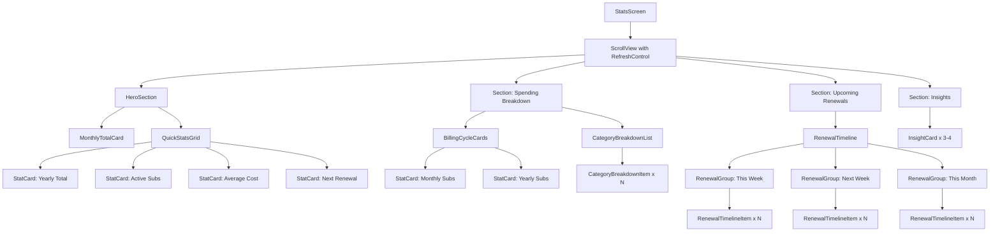
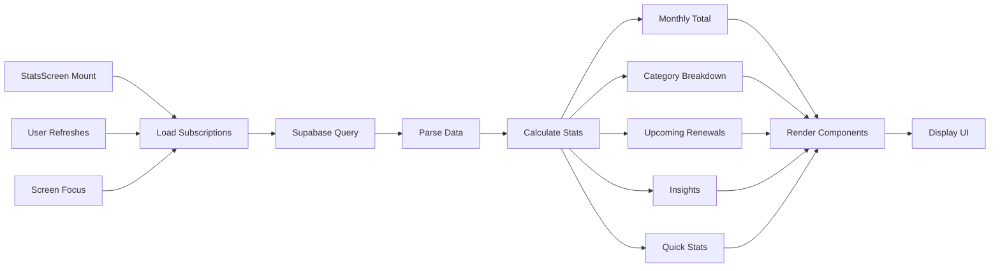

# Statistics Screen - Phase 1 Implementation Plan

## Component Architecture

## Data Flow

## Phase 1 Implementation Tasks

### 1. Utility Functions (utils/calculations.ts)

**Priority: Critical** - These must be completed first as all components depend on them

- [ ] **Task 1.1**: Add `getAverageSubscriptionCost()` function
  - Calculate average monthly cost across all subscriptions
  - Handle edge case: empty subscriptions array
  - Return 0 if no subscriptions
  - Add unit tests

- [ ] **Task 1.2**: Add `getNextRenewal()` function
  - Find subscription with soonest renewal date
  - Return subscription object and days until renewal
  - Return null if no subscriptions
  - Add unit tests

- [ ] **Task 1.3**: Add `getCategoryBreakdownWithPercentages()` function
  - Extend existing `getCategoryBreakdown()`
  - Calculate percentage of total for each category
  - Sort by amount (descending)
  - Return array of objects with category, amount, percentage
  - Add unit tests

- [ ] **Task 1.4**: Add `getBillingCycleStats()` function
  - Count subscriptions by billing cycle
  - Calculate total cost for each cycle (normalized to yearly)
  - Return object with monthly and yearly stats
  - Add unit tests

- [ ] **Task 1.5**: Add `getGroupedUpcomingRenewals()` function
  - Group renewals by time period (this week, next week, this month)
  - Use existing `getUpcomingRenewals()` as base
  - Return object with three arrays
  - Add unit tests

- [ ] **Task 1.6**: Add `generateBasicInsights()` function
  - Generate 3-4 insights based on subscription data
  - Types: upcoming renewals alert, top category, billing optimization
  - Return array of insight objects
  - Add unit tests

- [ ] **Task 1.7**: Add `getPotentialAnnualSavings()` function (optional for Phase 1)
  - Calculate savings if switching all monthly to annual (assume 10% discount)
  - Identify subscriptions that could be switched
  - Return savings amount and recommendations
  - Add unit tests

### 2. Core Components (components/)

**Priority: High** - Create reusable building blocks

- [ ] **Task 2.1**: Enhance `<SummaryCard>` component (or create new `<StatCard>`)
  - Already exists at `components/SummaryCard.tsx`
  - Review and enhance if needed for stats use case
  - Ensure it supports icon prop (optional)
  - Add TypeScript types
  - Test on both iOS and Android

- [ ] **Task 2.2**: Create `<Section>` component
  - Reusable section container with title
  - Props: title (string), children (ReactNode)
  - Consistent spacing and styling
  - Add to `components/Section.tsx`

- [ ] **Task 2.3**: Create `<HorizontalBarChart>` component
  - Pure React Native implementation (no library)
  - Props: value (number), maxValue (number), color (string), showPercentage (boolean)
  - Animated bar growth (optional for Phase 1)
  - Add to `components/HorizontalBarChart.tsx`

- [ ] **Task 2.4**: Create `<CategoryBreakdownItem>` component
  - Display category name, amount, and percentage
  - Include horizontal bar visualization
  - Use category color if available
  - Add to `components/CategoryBreakdownItem.tsx`

- [ ] **Task 2.5**: Create `<RenewalTimelineItem>` component
  - Display subscription name, cost, and days until renewal
  - Visual indicator for urgency (e.g., red for < 3 days)
  - Tappable to navigate to subscription details
  - Add to `components/RenewalTimelineItem.tsx`

- [ ] **Task 2.6**: Create `<InsightCard>` component
  - Display insight message with icon
  - Support different insight types (info, warning, success)
  - Optional action button
  - Add to `components/InsightCard.tsx`

### 3. Stats Screen Sections (screens/StatsScreen.tsx)

**Priority: High** - Build the main screen structure

- [ ] **Task 3.1**: Set up screen state and data loading
  - Add subscriptions state
  - Add loading and refreshing states
  - Implement data fetching with `storage.getAll()`
  - Add error handling
  - Add pull-to-refresh

- [ ] **Task 3.2**: Calculate all statistics with useMemo
  - Memoize monthly total
  - Memoize yearly total
  - Memoize average cost
  - Memoize next renewal
  - Memoize category breakdown
  - Memoize billing cycle stats
  - Memoize grouped renewals
  - Memoize insights

- [ ] **Task 3.3**: Build Hero Section
  - Create large monthly total display
  - Create 2x2 quick stats grid
  - Use existing `<SummaryCard>` or new `<StatCard>`
  - Implement responsive layout
  - Add loading skeletons

- [ ] **Task 3.4**: Build Spending Breakdown Section
  - Create billing cycle cards (monthly vs yearly)
  - Create category breakdown list
  - Implement horizontal bars for categories
  - Sort categories by spending
  - Add empty state if no subscriptions

- [ ] **Task 3.5**: Build Upcoming Renewals Section
  - Create grouped timeline (this week, next week, this month)
  - Use `<RenewalTimelineItem>` for each subscription
  - Add section headers for groups
  - Add empty state if no upcoming renewals
  - Make items tappable to navigate to EditSubscription

- [ ] **Task 3.6**: Build Insights Section
  - Display 3-4 generated insights
  - Use `<InsightCard>` component
  - Add appropriate icons for each insight type
  - Implement conditional rendering based on data

- [ ] **Task 3.7**: Integrate all sections into ScrollView
  - Wrap in ScrollView with RefreshControl
  - Add proper spacing between sections
  - Ensure smooth scrolling performance
  - Test on different screen sizes

### 4. Styling and Polish

**Priority: Medium** - Make it look professional

- [ ] **Task 4.1**: Apply consistent theme
  - Use existing theme colors, typography, spacing
  - Ensure dark mode support
  - Maintain design consistency with rest of app

- [ ] **Task 4.2**: Add loading states
  - Skeleton screens for initial load
  - Smooth transitions when data loads
  - Loading indicator for refresh

- [ ] **Task 4.3**: Add empty states
  - Empty state when no subscriptions exist
  - Empty state for sections with no data
  - Helpful messaging and call-to-action

- [ ] **Task 4.4**: Add haptic feedback
  - Feedback on card taps
  - Feedback on refresh
  - Use existing Haptics setup from HomeScreen

### 5. Testing and Quality Assurance

**Priority: High** - Ensure quality before shipping

- [ ] **Task 5.1**: Unit test all utility functions
  - Test edge cases (empty arrays, single subscription, etc.)
  - Test calculation accuracy
  - Test grouping and sorting logic

- [ ] **Task 5.2**: Test components in isolation
  - Test each component with various props
  - Test responsive behavior
  - Test accessibility features

- [ ] **Task 5.3**: Integration testing
  - Test full screen with real subscription data
  - Test with empty data
  - Test with large datasets (50+ subscriptions)
  - Test refresh functionality

- [ ] **Task 5.4**: Device testing
  - Test on iPhone (various sizes: SE, 14, 14 Pro Max)
  - Test on Android (various sizes)
  - Test on tablet if applicable
  - Test in landscape mode

- [ ] **Task 5.5**: Accessibility audit
  - Test with VoiceOver (iOS)
  - Test with TalkBack (Android)
  - Verify color contrast ratios
  - Verify touch target sizes

- [ ] **Task 5.6**: Performance testing
  - Measure render time
  - Test scroll performance
  - Check memory usage
  - Profile with React DevTools

### 6. Documentation and Cleanup

**Priority: Low** - Final touches

- [ ] **Task 6.1**: Add code comments
  - Document complex calculations
  - Add JSDoc comments for utility functions
  - Comment component props

- [ ] **Task 6.2**: Update README or docs
  - Document new Statistics screen features
  - Add screenshots if applicable
  - Update navigation documentation

- [ ] **Task 6.3**: Code review preparation
  - Self-review code
  - Run linter and fix issues
  - Ensure consistent formatting
  - Remove console.logs and debug code

## Estimated Timeline

- **Utilities**: 1 day (7 functions + tests)
- **Components**: 1.5 days (6 components)
- **Screen Assembly**: 1 day (7 tasks)
- **Styling & Polish**: 0.5 days
- **Testing & QA**: 1 day
- **Documentation**: 0.5 days

**Total: 5-6 development days**

## Dependencies Required

None for Phase 1! All components use native React Native.

## Success Criteria

- ✅ All 6 new utility functions implemented and tested
- ✅ All 6 components created and tested
- ✅ Statistics screen displays all 4 sections correctly
- ✅ Screen loads in < 1 second with typical dataset
- ✅ Smooth scrolling at 60fps
- ✅ Works on iOS and Android
- ✅ Accessibility compliant
- ✅ No crashes or errors
- ✅ Code reviewed and approved

## Implementation Order

1. **Start with utilities** - Foundation for everything else
2. **Create basic components** - Building blocks
3. **Build Hero Section** - Most important section first
4. **Add remaining sections** - One at a time
5. **Polish and test** - Make it production-ready
6. **Document and review** - Prepare for merge

## Notes

- Reuse existing components where possible (SummaryCard, LoadingIndicator, etc.)
- Follow existing code patterns from HomeScreen
- Use existing theme and styling conventions
- Implement optimistic UI patterns like HomeScreen
- Add proper TypeScript types for all new code
- Test incrementally as you build
- Get feedback early and often