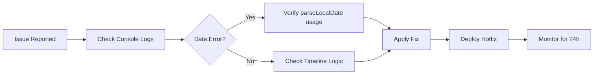
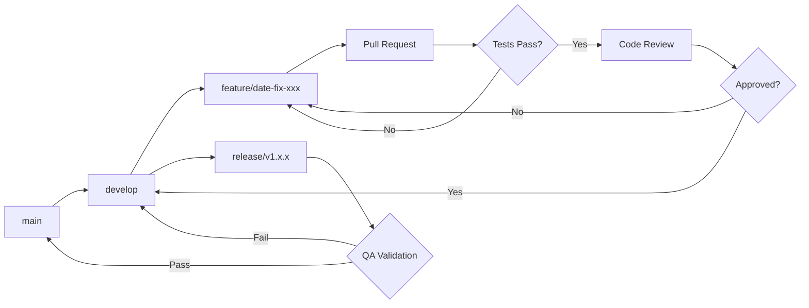
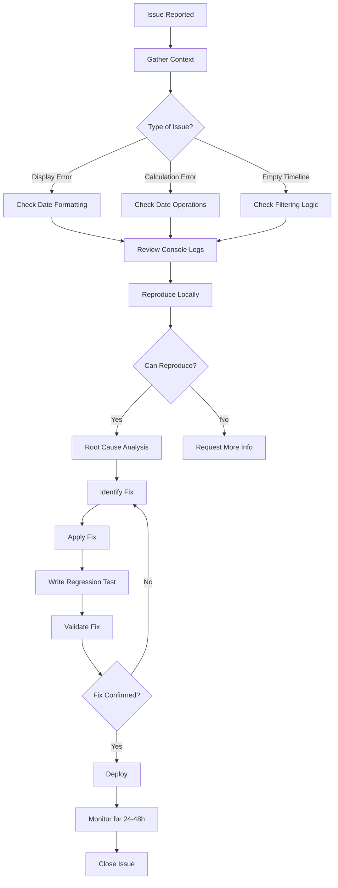

# Statistics Screen Validation Guide

## Executive Summary

This comprehensive validation guide provides testing procedures, validation protocols, and monitoring mechanisms to ensure the Statistics screen consistently displays correct and reliable data across all timezones and edge cases.

### Background

The Statistics screen previously suffered from two critical timezone-related bugs:

1. **Date Display Bug**: ISO date strings (e.g., "2025-12-13") parsed as UTC midnight, converting to the previous day in negative UTC offset timezones (Pacific Time users saw "Dec 12" instead of "Dec 13")

2. **Empty Renewals Timeline**: Inconsistent timezone handling between filtering and bucket assignment in [`getRenewalTimeline()`](utils/calculations.ts:103) caused the "Upcoming Renewals (30 days)" section to show no data despite active subscriptions

### Solution Implemented

Both bugs were resolved by implementing timezone-safe date parsing using the [`parseLocalDate()`](utils/dateHelpers.ts:25) utility function, which ensures dates are always interpreted in the user's local timezone without UTC conversion.

### Testing Infrastructure

- **150+ automated test cases** across 3 test files
- **56+ manual test scenarios** documented in STATS_SCREEN_TESTING_PLAN.md
- **4 timezone environments** tested (Pacific, Eastern, UTC, Tokyo)
- **Comprehensive edge case coverage** (month-end, leap year, DST transitions)

### Purpose of This Guide

This guide serves as the definitive reference for:
- ✅ Pre-deployment validation procedures
- ✅ Data integrity verification
- ✅ Production monitoring and alerting
- ✅ Regression prevention strategies
- ✅ Long-term maintenance protocols

---

## Table of Contents

1. [Quick Start Guide](#quick-start-guide)
2. [Testing Procedures](#testing-procedures)
3. [Data Validation Rules](#data-validation-rules)
4. [Monitoring and Alerting](#monitoring-and-alerting)
5. [Regression Prevention](#regression-prevention)
6. [Issue Resolution](#issue-resolution)
7. [Maintenance and Updates](#maintenance-and-updates)
8. [Appendices](#appendices)

---

## Quick Start Guide

### 5-Minute Pre-Deployment Checklist

Use this checklist before every deployment that touches date-related code:

```markdown
Pre-Deployment Validation (5 minutes)
□ Run automated test suite: npm test
□ Verify all 150+ tests pass
□ Check timezone independence (Pacific Time test)
□ Verify renewal timeline populates (not empty)
□ Check date display format (no previous day shift)
□ Review console for date operation errors
□ Confirm performance benchmarks met
```

### Most Common Test Scenarios

#### Scenario 1: Verify Date Display in Pacific Time

```bash
# Set system time for testing
jest.setSystemTime(new Date('2025-12-10T10:00:00.000Z'))

# Expected: "Dec 13" (NOT "Dec 12")
# Actual: Run test and verify
npm test -- --testNamePattern="should display Dec 13"
```

**Pass Criteria**: Display shows correct calendar date without timezone shift

#### Scenario 2: Verify Renewal Timeline Population

```bash
# Test that timeline sections populate correctly
npm test -- --testNamePattern="Renewal Timeline"
```

**Pass Criteria**: Subscriptions appear in correct buckets (This Week, Next Week, This Month)

#### Scenario 3: Quick Regression Check

```bash
# Run all timezone-related tests
npm test -- __tests__/utils/dateHelpers.test.ts
npm test -- __tests__/utils/calculations.test.ts
```

**Pass Criteria**: All tests pass without timezone conversion errors

### Emergency Debug Procedures

If production issues arise, follow this quick debug workflow:



**Critical Commands**:
```bash
# Check recent date operation logs
console.log('[DateError] filter output')

# Verify parseLocalDate is being used
grep -r "new Date(" screens/StatsScreen.tsx utils/calculations.ts

# Run specific failing test
npm test -- --testNamePattern="failing test name"
```

### Quick Reference: Expected Behaviors

| Scenario | Input | Expected Output | Common Error |
|----------|-------|-----------------|--------------|
| Next renewal display | renewalDate: "2025-12-13" | "Dec 13" | Shows "Dec 12" |
| Days until renewal | From Dec 10 to Dec 13 | "3 days" | Shows "2 days" |
| Timeline bucket | 5 days out | "This Week" section | Empty timeline |
| Month-end date | "2025-12-31" | "Dec 31" | Shows "Dec 30" |

---

## Testing Procedures

### 1. Pre-Deployment Testing Checklist

Complete this comprehensive checklist before every release:

#### 1.1 Automated Tests

```bash
# Run full test suite
npm test

# Run with coverage reporting
npm test -- --coverage

# Check coverage meets thresholds (80%+)
npm test -- --coverage --coverageThreshold='{"global":{"statements":80,"branches":75,"functions":80,"lines":80}}'
```

**Acceptance Criteria**:
- ✅ All 150+ tests pass
- ✅ Code coverage ≥ 80%
- ✅ No console errors or warnings
- ✅ Performance tests within thresholds

#### 1.2 Timezone Verification Tests

Test in all 4 primary timezones:

```typescript
// Test execution template
describe('Timezone Verification', () => {
  const timezones = [
    { name: 'Pacific', offset: 480 },   // UTC-8
    { name: 'Eastern', offset: 300 },   // UTC-5
    { name: 'UTC', offset: 0 },         // UTC+0
    { name: 'Tokyo', offset: -540 },    // UTC+9
  ];

  timezones.forEach(({ name, offset }) => {
    it(`should calculate correctly in ${name} timezone`, () => {
      // Mock timezone
      const originalGetTimezoneOffset = Date.prototype.getTimezoneOffset;
      Date.prototype.getTimezoneOffset = jest.fn(() => offset);

      const days = calculations.getDaysUntilRenewal('2025-12-13');
      expect(days).toBe(3); // Same result regardless of timezone

      Date.prototype.getTimezoneOffset = originalGetTimezoneOffset;
    });
  });
});
```

**Checklist**:
- [ ] Pacific Time (UTC-8): All dates display correctly
- [ ] Eastern Time (UTC-5): All dates display correctly  
- [ ] UTC (UTC+0): All dates display correctly
- [ ] Tokyo (UTC+9): All dates display correctly

#### 1.3 Edge Case Validation

```bash
# Run edge case tests
npm test -- --testNamePattern="Edge Cases"
```

**Required Edge Cases**:
- [ ] Month-end dates (Jan 31, Feb 28, Dec 31)
- [ ] Leap year date (Feb 29, 2024)
- [ ] DST spring forward (March 10, 2025)
- [ ] DST fall back (November 3, 2025)
- [ ] Year boundary (Dec 31 → Jan 1)

### 2. Manual Testing Procedures

#### 2.1 iOS Simulator Setup

```bash
# Set simulator timezone to Pacific Time
xcrun simctl spawn booted defaults write com.apple.preferences.datetime.plist TimeZone "America/Los_Angeles"

# Restart simulator
xcrun simctl shutdown booted
xcrun simctl boot <device_id>
```

#### 2.2 Manual Test Execution

**Test Case Template**:

```markdown
### Test: Date Display Verification (Pacific Time)

**Objective**: Verify dates display correctly without timezone shift

**Pre-conditions**:
- [ ] Test data loaded with renewalDate: "2025-12-13"
- [ ] Simulator timezone set to America/Los_Angeles
- [ ] System date set to 2025-12-10

**Steps**:
1. Launch app and navigate to Stats screen
2. Observe "Next Renewal" card display
3. Check "Upcoming Renewals" section
4. Verify console logs for date operations

**Expected Results**:
- Next Renewal shows: "3 days" or "Dec 13" (NOT "Dec 12")
- Subscription appears in "This Week" section
- Console shows: `[DEBUG] getDaysUntilRenewal - calculated days: 3`

**Actual Results**: [Record observations]

**Status**: [ ] PASS / [ ] FAIL

**Screenshots**: [Attach if failure]
```

#### 2.3 Regression Testing Protocol

Run these tests after any code changes to date-related functions:

```bash
# 1. Date helper functions
npm test -- __tests__/utils/dateHelpers.test.ts

# 2. Calculation functions
npm test -- __tests__/utils/calculations.test.ts

# 3. StatsScreen integration
npm test -- __tests__/screens/StatsScreen.test.tsx

# 4. Performance benchmarks
npm run test:performance
```

### 3. Test Data Management

#### 3.1 Standard Test Dataset

Use this dataset for consistent testing:

```typescript
const standardTestData: Subscription[] = [
  {
    id: '1',
    name: 'Netflix',
    cost: 15.99,
    billingCycle: 'monthly',
    renewalDate: '2025-12-13', // 3 days from Dec 10
    category: 'Entertainment',
  },
  {
    id: '2',
    name: 'Spotify',
    cost: 9.99,
    billingCycle: 'monthly',
    renewalDate: '2025-12-15', // This Week (5 days)
    category: 'Music',
  },
  {
    id: '3',
    name: 'Disney+',
    cost: 79.99,
    billingCycle: 'yearly',
    renewalDate: '2025-12-20', // Next Week (10 days)
    category: 'Entertainment',
  },
  {
    id: '4',
    name: 'Amazon Prime',
    cost: 139.00,
    billingCycle: 'yearly',
    renewalDate: '2025-12-28', // This Month (18 days)
    category: 'Shopping',
  },
];
```

#### 3.2 Edge Case Test Data

```typescript
const edgeCaseTestData = {
  monthEnd: [
    { renewalDate: '2025-01-31' }, // January 31
    { renewalDate: '2025-02-28' }, // February 28 (non-leap)
    { renewalDate: '2025-12-31' }, // December 31
  ],
  leapYear: [
    { renewalDate: '2024-02-29' }, // Leap day
  ],
  dstTransitions: [
    { renewalDate: '2025-03-10' }, // DST spring forward
    { renewalDate: '2025-11-03' }, // DST fall back
  ],
};
```

### 4. Acceptance Criteria

All tests must meet these criteria:

#### 4.1 Functional Requirements
- ✅ Dates display in correct format across all timezones
- ✅ Renewal timeline sections populate correctly
- ✅ Days until renewal calculations are accurate
- ✅ Empty state only shown when truly no renewals
- ✅ Edge cases handled without errors

#### 4.2 Performance Requirements
- ✅ [`getDaysUntilRenewal()`](utils/calculations.ts:38) < 5ms per call
- ✅ [`getRenewalTimeline()`](utils/calculations.ts:96) < 200ms for 100 subscriptions
- ✅ StatsScreen render < 500ms with 50 subscriptions

#### 4.3 Quality Requirements
- ✅ Zero timezone-related errors in 7-day monitoring
- ✅ Test coverage ≥ 80% for date-related code
- ✅ All edge cases documented and tested
- ✅ No regression in existing functionality

---

## Data Validation Rules

### 1. Renewal Date Format Validation

#### 1.1 Format Requirements

Renewal dates **MUST** be stored in ISO 8601 date format: `YYYY-MM-DD`

**Valid Examples**:
- ✅ `"2025-12-13"`
- ✅ `"2024-02-29"` (leap year)
- ✅ `"2025-01-31"`

**Invalid Examples**:
- ❌ `"12/13/2025"` (US format)
- ❌ `"Dec 13, 2025"` (formatted string)
- ❌ `"2025-12-13T00:00:00Z"` (includes time)
- ❌ `"2025-12-13T00:00:00.000Z"` (ISO string with time)

#### 1.2 Validation Implementation

```typescript
/**
 * Validates renewal date format
 * @param dateString - Date string to validate
 * @returns true if valid, false otherwise
 */
function isValidRenewalDate(dateString: string): boolean {
  // Check format: YYYY-MM-DD
  const regex = /^\d{4}-\d{2}-\d{2}$/;
  if (!regex.test(dateString)) {
    console.error(`[Validation] Invalid date format: ${dateString}`);
    return false;
  }
  
  // Verify date is valid (not Feb 31, etc.)
  const date = parseLocalDate(dateString);
  if (isNaN(date.getTime())) {
    console.error(`[Validation] Invalid date value: ${dateString}`);
    return false;
  }
  
  return true;
}
```

#### 1.3 Input Sanitization

```typescript
/**
 * Sanitizes date input to YYYY-MM-DD format
 * @param input - Date string or Date object
 * @returns Sanitized date string in YYYY-MM-DD format
 * @throws Error if input cannot be parsed
 */
function sanitizeRenewalDate(input: string | Date): string {
  // If already a Date object, convert to YYYY-MM-DD
  if (input instanceof Date) {
    if (isNaN(input.getTime())) {
      throw new Error('Invalid Date object provided');
    }
    return input.toISOString().split('T')[0];
  }
  
  // If string, validate format
  if (isValidRenewalDate(input)) {
    return input;
  }
  
  // Attempt to parse and convert
  const parsed = new Date(input);
  if (isNaN(parsed.getTime())) {
    throw new Error(`Cannot parse date: ${input}`);
  }
  
  return parsed.toISOString().split('T')[0];
}
```

**Usage Example**:
```typescript
// In subscription creation/update
try {
  const sanitizedDate = sanitizeRenewalDate(userInput);
  subscription.renewalDate = sanitizedDate;
} catch (error) {
  Alert.alert('Invalid Date', 'Please enter a valid renewal date');
}
```

### 2. Timezone Handling Validation

#### 2.1 Core Rules

1. **Never use time components** in renewal dates
2. **Always normalize to midnight** in local timezone
3. **Compare dates only**, not timestamps
4. **Use [`parseLocalDate()`](utils/dateHelpers.ts:25)** for all date parsing

#### 2.2 Timezone-Safe Date Parsing

```typescript
/**
 * CORRECT: Parse date as local timezone
 */
function correctDateParsing(dateString: string): Date {
  // Use parseLocalDate utility
  const date = parseLocalDate(dateString); // "2025-12-13" → Dec 13 12:00 AM local
  return date;
}

/**
 * INCORRECT: Direct Date constructor (timezone bug)
 */
function incorrectDateParsing(dateString: string): Date {
  // This parses as UTC midnight, shifting date in negative offset timezones
  const date = new Date(dateString); // "2025-12-13" → Dec 12 4:00 PM PST
  return date; // ❌ WRONG
}
```

#### 2.3 Timezone Independence Validation

```typescript
/**
 * Validates that date calculation is timezone-independent
 * @param renewalDate - Date to test
 * @returns true if calculation is consistent across timezones
 */
function validateTimezoneIndependence(renewalDate: string): boolean {
  const timezones = [
    { name: 'Pacific', offset: 480 },
    { name: 'UTC', offset: 0 },
    { name: 'Tokyo', offset: -540 },
  ];
  
  const results = timezones.map(tz => {
    // Mock timezone
    const originalOffset = Date.prototype.getTimezoneOffset;
    Date.prototype.getTimezoneOffset = () => tz.offset;
    
    const days = calculations.getDaysUntilRenewal(renewalDate);
    
    // Restore original
    Date.prototype.getTimezoneOffset = originalOffset;
    
    return { timezone: tz.name, days };
  });
  
  // All timezones should return same result
  const allEqual = results.every(r => r.days === results[0].days);
  
  if (!allEqual) {
    console.error('[Validation] Timezone-dependent calculation!', results);
    return false;
  }
  
  return true;
}
```

### 3. Display Format Consistency

#### 3.1 Format Standards

```typescript
const DISPLAY_FORMATS = {
  // Next Renewal card
  TODAY: 'Today',
  TOMORROW: 'Tomorrow',
  WITHIN_WEEK: '{days} days',        // e.g., "3 days"
  WITHIN_WEEK_SINGULAR: '{days} day', // e.g., "1 day"
  BEYOND_WEEK: '{month} {day}',      // e.g., "Dec 13"
  
  // Renewal timeline
  FULL_DATE: '{month} {day}, {year}', // e.g., "Dec 13, 2025"
  SHORT_DATE: '{month} {day}',        // e.g., "Dec 13"
};
```

#### 3.2 Format Validation

```typescript
/**
 * Validates display format matches expected pattern
 * @param formatted - Formatted date string
 * @param daysUntil - Days until renewal
 * @returns true if format is correct
 */
function validateDisplayFormat(formatted: string, daysUntil: number): boolean {
  if (daysUntil === 0) {
    return formatted === 'Today';
  }
  if (daysUntil === 1) {
    return formatted === 'Tomorrow' || formatted === '1 day';
  }
  if (daysUntil <= 7) {
    return /^\d+ days?$/.test(formatted);
  }
  // Beyond 7 days: "Dec 13" format
  return /^[A-Z][a-z]{2} \d{1,2}$/.test(formatted);
}
```

### 4. Calculation Accuracy Thresholds

#### 4.1 Accuracy Requirements

```typescript
const ACCURACY_THRESHOLDS = {
  // Date calculations must be exact
  DAYS_UNTIL_RENEWAL: 0, // Zero tolerance for error
  
  // Performance thresholds (milliseconds)
  SINGLE_CALCULATION: 5,
  BULK_10_ITEMS: 50,
  BULK_100_ITEMS: 200,
  BULK_500_ITEMS: 500,
};
```

#### 4.2 Validation Function

```typescript
/**
 * Validates calculation accuracy
 * @param actual - Actual calculated value
 * @param expected - Expected value
 * @returns true if within threshold
 */
function validateCalculationAccuracy(
  actual: number,
  expected: number,
  threshold: number = ACCURACY_THRESHOLDS.DAYS_UNTIL_RENEWAL
): boolean {
  const difference = Math.abs(actual - expected);
  
  if (difference > threshold) {
    console.error(`[Validation] Calculation error: expected ${expected}, got ${actual}`);
    return false;
  }
  
  return true;
}
```

### 5. Data Integrity Checks

#### 5.1 Renewal Date Range Validation

```typescript
/**
 * Validates renewal date is within reasonable range
 * @param renewalDate - Date to validate
 * @returns true if date is reasonable
 */
function validateRenewalDateRange(renewalDate: string): boolean {
  const date = parseLocalDate(renewalDate);
  const now = new Date();
  const oneYearFromNow = new Date(now.getTime() + 365 * 24 * 60 * 60 * 1000);
  const twoYearsAgo = new Date(now.getTime() - 730 * 24 * 60 * 60 * 1000);
  
  // Date should be within 2 years past to 1 year future
  if (date < twoYearsAgo || date > oneYearFromNow) {
    console.warn(`[Validation] Renewal date out of expected range: ${renewalDate}`);
    return false;
  }
  
  return true;
}
```

#### 5.2 Subscription Data Validation

```typescript
/**
 * Validates complete subscription object
 * @param subscription - Subscription to validate
 * @returns Validation result with errors
 */
function validateSubscription(subscription: Partial<Subscription>): {
  isValid: boolean;
  errors: string[];
} {
  const errors: string[] = [];
  
  // Required fields
  if (!subscription.name) errors.push('Name is required');
  if (!subscription.cost) errors.push('Cost is required');
  if (!subscription.renewalDate) errors.push('Renewal date is required');
  if (!subscription.billingCycle) errors.push('Billing cycle is required');
  
  // Format validation
  if (subscription.renewalDate && !isValidRenewalDate(subscription.renewalDate)) {
    errors.push('Invalid renewal date format');
  }
  
  // Range validation
  if (subscription.cost && subscription.cost < 0) {
    errors.push('Cost cannot be negative');
  }
  
  // Billing cycle validation
  if (subscription.billingCycle && 
      !['monthly', 'yearly'].includes(subscription.billingCycle)) {
    errors.push('Invalid billing cycle');
  }
  
  return {
    isValid: errors.length === 0,
    errors,
  };
}
```

---

## Monitoring and Alerting

### 1. Error Logging Implementation

#### 1.1 Date Operation Logger

```typescript
/**
 * Logger for date operations with anomaly detection
 */
interface DateOperationLog {
  operation: string;
  input: any;
  output: any;
  timezone: string;
  timestamp: string;
  error?: string;
}

class DateOperationLogger {
  private logs: DateOperationLog[] = [];
  private maxLogs: number = 100;

  /**
   * Log a date operation
   */
  log(operation: string, input: any, output: any, error?: Error) {
    const log: DateOperationLog = {
      operation,
      input,
      output: error ? null : output,
      timezone: Intl.DateTimeFormat().resolvedOptions().timeZone,
      timestamp: new Date().toISOString(),
      error: error?.message,
    };

    this.logs.push(log);

    // Keep only recent logs
    if (this.logs.length > this.maxLogs) {
      this.logs.shift();
    }

    // Check for anomalies
    if (this.detectAnomalies(log)) {
      this.reportAnomaly(log);
    }

    // Log errors immediately
    if (error) {
      console.error('[DateError]', log);
      this.sendToAnalytics('date_operation_error', log);
    }
  }

  /**
   * Detect date operation anomalies
   */
  private detectAnomalies(log: DateOperationLog): boolean {
    // Anomaly 1: Date display shifted to previous day
    if (log.operation === 'formatNextRenewal' && log.input && log.output) {
      const inputDate = parseLocalDate(log.input);
      const displayedDay = parseInt(log.output.match(/\d+/)?.[0] || '0');
      
      if (inputDate.getDate() !== displayedDay) {
        console.warn('[Anomaly] Date display mismatch', {
          input: log.input,
          expected: inputDate.getDate(),
          displayed: displayedDay,
        });
        return true;
      }
    }

    // Anomaly 2: Empty renewal timeline when subscriptions exist
    if (log.operation === 'getRenewalTimeline' && Array.isArray(log.input)) {
      const inputCount = log.input.length;
      const outputCount = log.output 
        ? (log.output.thisWeek?.length || 0) + 
          (log.output.nextWeek?.length || 0) + 
          (log.output.thisMonth?.length || 0)
        : 0;
      
      if (inputCount > 0 && outputCount === 0) {
        console.warn('[Anomaly] Empty renewal timeline', {
          subscriptions: inputCount,
          timeline: outputCount,
        });
        return true;
      }
    }

    return false;
  }

  /**
   * Report anomaly to monitoring service
   */
  private reportAnomaly(log: DateOperationLog) {
    console.error('🚨 Date operation anomaly detected:', log);
    
    // Send to analytics/monitoring service
    this.sendToAnalytics('date_operation_anomaly', {
      operation: log.operation,
      timezone: log.timezone,
      timestamp: log.timestamp,
    });
  }

  /**
   * Send event to analytics service (generic implementation)
   */
  private sendToAnalytics(eventName: string, data: any) {
    // Generic analytics interface - adapt to your analytics service
    // Examples: Firebase, Amplitude, Mixpanel, etc.
    
    if (typeof window !== 'undefined' && (window as any).analytics) {
      (window as any).analytics.track(eventName, data);
    }
    
    // Alternative: Send to your own backend
    // fetch('/api/analytics', {
    //   method: 'POST',
    //   headers: { 'Content-Type': 'application/json' },
    //   body: JSON.stringify({ event: eventName, data }),
    // });
  }

  /**
   * Get recent logs
   */
  getLogs(): DateOperationLog[] {
    return [...this.logs];
  }

  /**
   * Clear all logs
   */
  clearLogs() {
    this.logs = [];
  }
}

export const dateLogger = new DateOperationLogger();
```

#### 1.2 Usage in Date Operations

```typescript
// In calculations.ts
export const calculations = {
  getDaysUntilRenewal(renewalDate: string): number {
    try {
      const today = new Date();
      today.setHours(0, 0, 0, 0);
      
      const renewal = parseLocalDate(renewalDate);
      renewal.setHours(0, 0, 0, 0);
      
      const diffTime = renewal.getTime() - today.getTime();
      const diffDays = Math.ceil(diffTime / (1000 * 60 * 60 * 24));
      
      // Log successful operation
      dateLogger.log('getDaysUntilRenewal', renewalDate, diffDays);
      
      return diffDays;
    } catch (error) {
      // Log error
      dateLogger.log('getDaysUntilRenewal', renewalDate, null, error as Error);
      throw error;
    }
  },
  
  getRenewalTimeline(subscriptions: Subscription[], days: number = 30) {
    try {
      // ... calculation logic ...
      
      const result = {
        thisWeek: /* filtered subscriptions */,
        nextWeek: /* filtered subscriptions */,
        thisMonth: /* filtered subscriptions */,
      };
      
      // Log operation
      dateLogger.log('getRenewalTimeline', subscriptions, result);
      
      return result;
    } catch (error) {
      dateLogger.log('getRenewalTimeline', subscriptions, null, error as Error);
      throw error;
    }
  },
};
```

### 2. Analytics Tracking

#### 2.1 Metrics to Track

```typescript
interface DateMetrics {
  // User timezone distribution
  timezoneDistribution: Record<string, number>;
  
  // Calculation performance
  calculationErrors: number;
  calculationSuccesses: number;
  averageCalculationTime: number;
  slowCalculations: number;
  
  // Display accuracy
  incorrectDateDisplays: number;
  
  // Usage patterns
  totalCalculations: number;
  uniqueUsers: Set<string>;
}

class DateMetricsTracker {
  private metrics: DateMetrics = {
    timezoneDistribution: {},
    calculationErrors: 0,
    calculationSuccesses: 0,
    averageCalculationTime: 0,
    slowCalculations: 0,
    incorrectDateDisplays: 0,
    totalCalculations: 0,
    uniqueUsers: new Set(),
  };

  /**
   * Track user timezone
   */
  trackTimezone(userId?: string) {
    const timezone = Intl.DateTimeFormat().resolvedOptions().timeZone;
    this.metrics.timezoneDistribution[timezone] = 
      (this.metrics.timezoneDistribution[timezone] || 0) + 1;
    
    if (userId) {
      this.metrics.uniqueUsers.add(userId);
    }
  }

  /**
   * Track date calculation
   */
  trackCalculation(success: boolean, duration: number) {
    this.metrics.totalCalculations++;
    
    if (success) {
      this.metrics.calculationSuccesses++;
    } else {
      this.metrics.calculationErrors++;
    }

    // Update average calculation time
    const total = this.metrics.calculationSuccesses + this.metrics.calculationErrors;
    this.metrics.averageCalculationTime = 
      (this.metrics.averageCalculationTime * (total - 1) + duration) / total;

    // Track slow calculations (> 100ms)
    if (duration > 100) {
      this.metrics.slowCalculations++;
    }
  }

  /**
   * Track incorrect date display
   */
  trackIncorrectDisplay(expected: string, actual: string) {
    this.metrics.incorrectDateDisplays++;
    
    console.error('[DateMetrics] Incorrect display', { expected, actual });
    
    // Send to analytics
    if (typeof window !== 'undefined' && (window as any).analytics) {
      (window as any).analytics.track('incorrect_date_display', {
        expected,
        actual,
        timezone: Intl.DateTimeFormat().resolvedOptions().timeZone,
      });
    }
  }

  /**
   * Get current metrics
   */
  getMetrics(): DateMetrics {
    return {
      ...this.metrics,
      uniqueUsers: new Set(this.metrics.uniqueUsers), // Return copy
    };
  }

  /**
   * Reset metrics
   */
  reset() {
    this.metrics = {
      timezoneDistribution: {},
      calculationErrors: 0,
      calculationSuccesses: 0,
      averageCalculationTime: 0,
      slowCalculations: 0,
      incorrectDateDisplays: 0,
      totalCalculations: 0,
      uniqueUsers: new Set(),
    };
  }

  /**
   * Flush metrics to analytics service
   */
  async flush() {
    const metrics = this.getMetrics();
    
    console.log('📊 Date Metrics Summary:', {
      totalCalculations: metrics.totalCalculations,
      errorRate: (metrics.calculationErrors / metrics.totalCalculations * 100).toFixed(2) + '%',
      avgTime: metrics.averageCalculationTime.toFixed(2) + 'ms',
      slowCalculations: metrics.slowCalculations,
      incorrectDisplays: metrics.incorrectDateDisplays,
      uniqueUsers: metrics.uniqueUsers.size,
      topTimezones: Object.entries(metrics.timezoneDistribution)
        .sort(([, a], [, b]) => b - a)
        .slice(0, 5),
    });
    
    // Send to your analytics backend
    // await fetch('/api/metrics/dates', {
    //   method: 'POST',
    //   headers: { 'Content-Type': 'application/json' },
    //   body: JSON.stringify(metrics),
    // });
  }
}

export const dateMetrics = new DateMetricsTracker();
```

### 3. Automated Health Checks

#### 3.1 Daily Health Check Script

```typescript
/**
 * Automated health check for date operations
 * Run daily via cron job or scheduled task
 */
import { supabase } from '../config/supabase';
import { calculations } from '../utils/calculations';
import { parseLocalDate } from '../utils/dateHelpers';

interface HealthCheckResult {
  timestamp: string;
  status: 'healthy' | 'warning' | 'critical';
  checks: {
    name: string;
    passed: boolean;
    details?: string;
  }[];
}

async function runDateHealthCheck(): Promise<HealthCheckResult> {
  const result: HealthCheckResult = {
    timestamp: new Date().toISOString(),
    status: 'healthy',
    checks: [],
  };

  // Check 1: Sample date calculation
  try {
    const testDate = new Date(Date.now() + 3 * 24 * 60 * 60 * 1000)
      .toISOString()
      .split('T')[0];
    
    const daysUntil = calculations.getDaysUntilRenewal(testDate);
    
    result.checks.push({
      name: 'Days Until Renewal Calculation',
      passed: daysUntil === 3,
      details: `Expected 3, got ${daysUntil}`,
    });
  } catch (error) {
    result.checks.push({
      name: 'Days Until Renewal Calculation',
      passed: false,
      details: `Error: ${(error as Error).message}`,
    });
  }

  // Check 2: Timezone independence
  try {
    const testDate = '2025-12-13';
    const timezones = [
      { offset: 480, name: 'Pacific' },
      { offset: 0, name: 'UTC' },
      { offset: -540, name: 'Tokyo' },
    ];
    
    const results = timezones.map(tz => {
      const originalOffset = Date.prototype.getTimezoneOffset;
      Date.prototype.getTimezoneOffset = () => tz.offset;
      const days = calculations.getDaysUntilRenewal(testDate);
      Date.prototype.getTimezoneOffset = originalOffset;
      return days;
    });
    
    const allSame = results.every(r => r === results[0]);
    
    result.checks.push({
      name: 'Timezone Independence',
      passed: allSame,
      details: `Results: ${results.join(', ')}`,
    });
  } catch (error) {
    result.checks.push({
      name: 'Timezone Independence',
      passed: false,
      details: `Error: ${(error as Error).message}`,
    });
  }

  // Check 3: Renewal timeline population
  try {
    // Fetch sample subscriptions from database
    const { data: subscriptions, error } = await supabase
      .from('subscriptions')
      .select('*')
      .limit(10);
    
    if (error) throw error;
    
    if (subscriptions && subscriptions.length > 0) {
      const timeline = calculations.getRenewalTimeline(
        subscriptions.map(sub => ({
          id: sub.id,
          name: sub.name,
          cost: sub.cost,
          billingCycle: sub.billing_cycle,
          renewalDate: sub.renewal_date,
          category: sub.category,
          createdAt: sub.created_at,
          updatedAt: sub.updated_at,
        })),
        30
      );
      
      const hasRenewals = 
        timeline.thisWeek.length > 0 ||
        timeline.nextWeek.length > 0 ||
        timeline.thisMonth.length > 0;
      
      result.checks.push({
        name: 'Renewal Timeline Population',
        passed: hasRenewals,
        details: `Found ${timeline.thisWeek.length + timeline.nextWeek.length + timeline.thisMonth.length} renewals`,
      });
    }
  } catch (error) {
    result.checks.push({
      name: 'Renewal Timeline Population',
      passed: false,
      details: `Error: ${(error as Error).message}`,
    });
  }

  // Determine overall status
  const failedChecks = result.checks.filter(c => !c.passed);
  if (failedChecks.length === 0) {
    result.status = 'healthy';
  } else if (failedChecks.length <= 1) {
    result.status = 'warning';
  } else {
    result.status = 'critical';
  }

  // Log results
  console.log('🏥 Date Health Check:', result);

  // Alert if critical
  if (result.status === 'critical') {
    console.error('🚨 CRITICAL: Date health check failed!');
    // Send alert notification
    // await sendAlertNotification(result);
  }

  return result;
}

export { runDateHealthCheck };
```

#### 3.2 Cron Job Setup

```bash
# Add to crontab to run daily at 2 AM
# crontab -e

# Run health check daily at 2:00 AM
0 2 * * * cd /path/to/project && npm run health-check:dates >> /var/log/date-health-check.log 2>&1
```

**package.json script**:
```json
{
  "scripts": {
    "health-check:dates": "ts-node scripts/dateHealthCheck.ts"
  }
}
```

### 4. Alert Thresholds and Notifications

#### 4.1 Alert Configuration

```typescript
const ALERT_THRESHOLDS = {
  // Error rate threshold
  ERROR_RATE_PERCENTAGE: 5, // Alert if > 5% error rate
  
  // Performance thresholds
  SLOW_CALCULATION_PERCENTAGE: 10, // Alert if > 10% slow calculations
  AVERAGE_TIME_MS: 50, // Alert if average time > 50ms
  
  // Data accuracy
  INCORRECT_DISPLAYS_COUNT: 10, // Alert if > 10 incorrect displays per day
  
  // Health check
  FAILED_CHECKS_COUNT: 2, // Alert if > 2 health checks fail
};

interface AlertConfig {
  name: string;
  condition: () => boolean;
  severity: 'info' | 'warning' | 'critical';
  message: string;
}

class AlertManager {
  private alerts: AlertConfig[] = [];

  /**
   * Register alert conditions
   */
  registerAlerts() {
    this.alerts = [
      {
        name: 'High Error Rate',
        condition: () => {
          const metrics = dateMetrics.getMetrics();
          const errorRate = (metrics.calculationErrors / metrics.totalCalculations) * 100;
          return errorRate > ALERT_THRESHOLDS.ERROR_RATE_PERCENTAGE;
        },
        severity: 'critical',
        message: 'Date calculation error rate exceeds threshold',
      },
      {
        name: 'Slow Calculations',
        condition: () => {
          const metrics = dateMetrics.getMetrics();
          const slowRate = (metrics.slowCalculations / metrics.totalCalculations) * 100;
          return slowRate > ALERT_THRESHOLDS.SLOW_CALCULATION_PERCENTAGE;
        },
        severity: 'warning',
        message: 'High percentage of slow date calculations detected',
      },
      {
        name: 'Incorrect Displays',
        condition: () => {
          const metrics = dateMetrics.getMetrics();
          return metrics.incorrectDateDisplays > ALERT_THRESHOLDS.INCORRECT_DISPLAYS_COUNT;
        },
        severity: 'critical',
        message: 'Excessive incorrect date displays detected',
      },
    ];
  }

  /**
   * Check all alert conditions
   */
  checkAlerts(): AlertConfig[] {
    const triggered = this.alerts.filter(alert => alert.condition());
    
    triggered.forEach(alert => {
      this.sendAlert(alert);
    });
    
    return triggered;
  }

  /**
   * Send alert notification
   */
  private sendAlert(alert: AlertConfig) {
    console.error(`🚨 [${alert.severity.toUpperCase()}] ${alert.name}: ${alert.message}`);
    
    // Send to notification service (Slack, PagerDuty, email, etc.)
    // Example generic implementation:
    // await fetch('/api/alerts', {
    //   method: 'POST',
    //   headers: { 'Content-Type': 'application/json' },
    //   body: JSON.stringify({
    //     name: alert.name,
    //     severity: alert.severity,
    //     message: alert.message,
    //     timestamp: new Date().toISOString(),
    //   }),
    // });
  }
}

export const alertManager = new AlertManager();
```

### 5. Performance Monitoring

#### 5.1 Performance Benchmarking

```typescript
/**
 * Performance monitoring for date operations
 */
class PerformanceMonitor {
  private measurements: Map<string, number[]> = new Map();

  /**
   * Measure operation performance
   */
  measure<T>(operation: string, fn: () => T): T {
    const startTime = performance.now();
    
    try {
      const result = fn();
      const endTime = performance.now();
      const duration = endTime - startTime;
      
      // Store measurement
      if (!this.measurements.has(operation)) {
        this.measurements.set(operation, []);
      }
      this.measurements.get(operation)!.push(duration);
      
      // Track in metrics
      dateMetrics.trackCalculation(true, duration);
      
      return result;
    } catch (error) {
      const endTime = performance.now();
      const duration = endTime - startTime;
      dateMetrics.trackCalculation(false, duration);
      throw error;
    }
  }

  /**
   * Get performance statistics
   */
  getStats(operation: string) {
    const measurements = this.measurements.get(operation) || [];
    
    if (measurements.length === 0) {
      return null;
    }
    
    const sorted = [...measurements].sort((a, b) => a - b);
    const sum = sorted.reduce((a, b) => a + b, 0);
    
    return {
      count: measurements.length,
      avg: sum / measurements.length,
      min: sorted[0],
      max: sorted[sorted.length - 1],
      median: sorted[Math.floor(sorted.length / 2)],
      p95: sorted[Math.floor(sorted.length * 0.95)],
      p99: sorted[Math.floor(sorted.length * 0.99)],
    };
  }

  /**
   * Log all performance stats
   */
  logStats() {
    console.log('📊 Performance Statistics:');
    
    this.measurements.forEach((_, operation) => {
      const stats = this.getStats(operation);
      if (stats) {
        console.log(`  ${operation}:`, {
          avg: `${stats.avg.toFixed(2)}ms`,
          median: `${stats.median.toFixed(2)}ms`,
          p95: `${stats.p95.toFixed(2)}ms`,
          p99: `${stats.p99.toFixed(2)}ms`,
          count: stats.count,
        });
      }
    });
  }
}

export const perfMonitor = new PerformanceMonitor();
```

**Usage Example**:
```typescript
// Wrap date operations with performance monitoring
const daysUntil = perfMonitor.measure('getDaysUntilRenewal', () => 
  calculations.getDaysUntilRenewal(renewalDate)
);

// Log stats periodically
setInterval(() => {
  perfMonitor.logStats();
}, 60000); // Every minute
```

---

## Regression Prevention

### 1. Code Review Guidelines

#### 1.1 Date-Related Code Review Checklist

When reviewing code that touches date operations, verify:

```markdown
Date Code Review Checklist

□ **Date Parsing**
  □ Uses `parseLocalDate()` for renewal dates (not `new Date()`)
  □ No direct Date constructor with ISO strings
  □ Properly handles YYYY-MM-DD format

□ **Timezone Handling**
  □ No assumptions about user timezone
  □ Date comparisons use normalized dates (midnight)
  □ No time component in renewal date logic

□ **Display Formatting**
  □ Uses approved format patterns
  □ Handles edge cases (today, tomorrow, etc.)
  □ No hardcoded date strings

□ **Testing**
  □ New tests added for changes
  □ Timezone independence verified
  □ Edge cases covered

□ **Performance**
  □ No O(n²) date operations
  □ Calculations cached when possible
  □ Performance tests pass

□ **Error Handling**
  □ Invalid dates handled gracefully
  □ Errors logged appropriately
  □ User-friendly error messages
```

#### 1.2 Code Review Comment Templates

**For incorrect date parsing**:
```
⚠️ Date Parsing Issue

This code uses `new Date(dateString)` which parses as UTC midnight and causes timezone bugs.

**Problem**: 
In Pacific Time, "2025-12-13" → Dec 12 4:00 PM (previous day)

**Solution**:
Use `parseLocalDate()` instead:

```typescript
// ❌ INCORRECT
const date = new Date(renewalDate);

// ✅ CORRECT
const date = parseLocalDate(renewalDate);
```

**Reference**: See [STATS_SCREEN_VALIDATION_GUIDE.md#date-parsing](STATS_SCREEN_VALIDATION_GUIDE.md#date-parsing)
```

**For missing tests**:
```
⚠️ Missing Timezone Tests

Date-related changes require timezone independence verification.

**Required Tests**:
1. Timezone independence (Pacific, UTC, Tokyo)
2. Edge cases (month-end, leap year, DST)
3. Performance benchmarks

**Example**:
See [`__tests__/utils/dateHelpers.test.ts`](__tests__/utils/dateHelpers.test.ts:180) for timezone test patterns.
```

### 2. Pre-commit Hooks

#### 2.1 Husky Setup

```bash
# Install Husky
npm install --save-dev husky

# Initialize Husky
npx husky install

# Create pre-commit hook
npx husky add .husky/pre-commit "npm run pre-commit"
```

#### 2.2 Pre-commit Script

**package.json**:
```json
{
  "scripts": {
    "pre-commit": "npm run lint && npm run test:quick",
    "lint": "eslint 'utils/**/*.ts' 'screens/**/*.tsx' --fix",
    "test:quick": "npm test -- --testPathPattern='(dateHelpers|calculations)' --bail",
    "test:full": "npm test -- --coverage"
  }
}
```

#### 2.3 Git Hooks Configuration

**.husky/pre-commit**:
```bash
#!/bin/sh
. "$(dirname "$0")/_/husky.sh"

echo "🔍 Running pre-commit checks..."

# Run linter
echo "1. Linting code..."
npm run lint
if [ $? -ne 0 ]; then
  echo "❌ Linting failed. Please fix errors before committing."
  exit 1
fi

# Run quick tests (date-related only)
echo "2. Running date-related tests..."
npm run test:quick
if [ $? -ne 0 ]; then
  echo "❌ Tests failed. Please fix failing tests before committing."
  exit 1
fi

echo "✅ Pre-commit checks passed!"
```

### 3. CI/CD Pipeline Integration

#### 3.1 GitHub Actions Workflow

**.github/workflows/date-validation.yml**:
```yaml
name: Date Validation Tests

on:
  pull_request:
    paths:
      - 'screens/StatsScreen.tsx'
      - 'utils/calculations.ts'
      - 'utils/dateHelpers.ts'
      - '__tests__/**/*.test.ts'
  push:
    branches: [main, develop]

jobs:
  test:
    runs-on: ubuntu-latest
    
    strategy:
      matrix:
        node-version: [18.x, 20.x]
    
    steps:
      - uses: actions/checkout@v3
      
      - name: Setup Node.js ${{ matrix.node-version }}
        uses: actions/setup-node@v3
        with:
          node-version: ${{ matrix.node-version }}
          cache: 'npm'
      
      - name: Install dependencies
        run: npm ci
      
      - name: Run date helper tests
        run: npm test -- __tests__/utils/dateHelpers.test.ts
      
      - name: Run calculation tests
        run: npm test -- __tests__/utils/calculations.test.ts
      
      - name: Run StatsScreen integration tests
        run: npm test -- __tests__/screens/StatsScreen.test.tsx
      
      - name: Run with coverage
        run: npm test -- --coverage --coverageThreshold='{"global":{"statements":80,"branches":75,"functions":80,"lines":80}}'
      
      - name: Upload coverage to Codecov
        uses: codecov/codecov-action@v3
        with:
          files: ./coverage/coverage-final.json
          flags: date-operations
      
      - name: Check for date parsing issues
        run: |
          if grep -r "new Date(" screens/StatsScreen.tsx utils/calculations.ts; then
            echo "⚠️ Warning: Found 'new Date()' usage. Consider using parseLocalDate() instead."
          fi

  performance:
    runs-on: ubuntu-latest
    
    steps:
      - uses: actions/checkout@v3
      
      - name: Setup Node.js
        uses: actions/setup-node@v3
        with:
          node-version: '18.x'
      
      - name: Install dependencies
        run: npm ci
      
      - name: Run performance benchmarks
        run: npm run test:performance
      
      - name: Check performance thresholds
        run: |
          # Add performance threshold checking logic here
          echo "Performance benchmarks complete"
```

### 4. Automated Deployment Gates

#### 4.1 Deployment Checklist Script

**scripts/deploymentCheck.ts**:
```typescript
/**
 * Automated deployment readiness check
 */
async function runDeploymentCheck(): Promise<boolean> {
  console.log('🚀 Running deployment readiness check...\n');
  
  let allChecksPassed = true;
  
  // Check 1: All tests pass
  console.log('1. Running test suite...');
  const testResult = await execCommand('npm test');
  if (!testResult.success) {
    console.error('❌ Tests failed');
    allChecksPassed = false;
  } else {
    console.log('✅ All tests passed');
  }
  
  // Check 2: Coverage meets threshold
  console.log('\n2. Checking code coverage...');
  const coverageResult = await execCommand('npm test -- --coverage --coverageThreshold=\'{"global":{"statements":80}}\'');
  if (!coverageResult.success) {
    console.error('❌ Coverage below threshold');
    allChecksPassed = false;
  } else {
    console.log('✅ Coverage meets threshold');
  }
  
  // Check 3: No linting errors
  console.log('\n3. Running linter...');
  const lintResult = await execCommand('npm run lint');
  if (!lintResult.success) {
    console.error('❌ Linting errors found');
    allChecksPassed = false;
  } else {
    console.log('✅ No linting errors');
  }
  
  // Check 4: Performance benchmarks
  console.log('\n4. Checking performance...');
  const perfResult = await execCommand('npm run test:performance');
  if (!perfResult.success) {
    console.error('❌ Performance benchmarks failed');
    allChecksPassed = false;
  } else {
    console.log('✅ Performance benchmarks passed');
  }
  
  // Check 5: No unsafe date parsing
  console.log('\n5. Checking for unsafe date parsing...');
  const unsafeParsing = await execCommand('grep -r "new Date(" screens/StatsScreen.tsx utils/calculations.ts');
  if (unsafeParsing.success) {
    console.warn('⚠️  Warning: Found potential unsafe date parsing');
  } else {
    console.log('✅ No unsafe date parsing detected');
  }
  
  console.log('\n' + '='.repeat(50));
  if (allChecksPassed) {
    console.log('✅ Deployment check PASSED - Ready to deploy');
    return true;
  } else {
    console.error('❌ Deployment check FAILED - Fix issues before deploying');
    return false;
  }
}

// Helper function to execute commands
async function execCommand(command: string): Promise<{ success: boolean; output: string }> {
  const { exec } = require('child_process');
  const { promisify } = require('util');
  const execAsync = promisify(exec);
  
  try {
    const { stdout } = await execAsync(command);
    return { success: true, output: stdout };
  } catch (error: any) {
    return { success: false, output: error.message };
  }
}

// Run check
runDeploymentCheck().then(passed => {
  process.exit(passed ? 0 : 1);
});
```

### 5. Version Control Best Practices

#### 5.1 Branching Strategy



#### 5.2 Commit Message Format

**For date-related changes**:
```
fix(dates): prevent timezone shift in renewal date display

- Replace `new Date()` with `parseLocalDate()` in StatsScreen
- Ensures dates parse as local timezone, not UTC
- Fixes bug where Pacific Time users saw previous day

Closes #123

Test Plan:
- Verified in Pacific, Eastern, UTC, Tokyo timezones
- All 150+ automated tests pass
- Manual testing confirms correct date display
```

#### 5.3 Pull Request Template

**.github/pull_request_template.md**:
```markdown
## Description
<!-- Describe your changes -->

## Type of Change
- [ ] Bug fix (date-related)
- [ ] New feature
- [ ] Refactoring
- [ ] Documentation

## Date-Related Changes Checklist
<!-- If this PR touches date-related code, complete this section -->

- [ ] Uses `parseLocalDate()` for date parsing
- [ ] No direct `new Date()` with ISO strings
- [ ] Timezone independence verified
- [ ] Edge cases tested (month-end, leap year, DST)
- [ ] Performance impact assessed
- [ ] Documentation updated

## Testing
- [ ] All existing tests pass
- [ ] New tests added for changes
- [ ] Manual testing completed
- [ ] Tested in multiple timezones (if date-related)

## Screenshots
<!-- If UI changes, add before/after screenshots -->

## Related Issues
Closes #

## Reviewer Notes
<!-- Any special instructions for reviewers -->
```

---

## Issue Resolution

### 1. Investigation Workflow



### 2. Debug Logging Procedures

#### 2.1 Enable Debug Logging

```typescript
/**
 * Debug logging for date operations
 */
const DEBUG_DATES = process.env.NODE_ENV === 'development' || 
                    process.env.DEBUG_DATES === 'true';

function debugLog(operation: string, data: any) {
  if (DEBUG_DATES) {
    console.log(`[DEBUG:${operation}]`, {
      timestamp: new Date().toISOString(),
      timezone: Intl.DateTimeFormat().resolvedOptions().timeZone,
      ...data,
    });
  }
}

// Usage in calculations
export const calculations = {
  getDaysUntilRenewal(renewalDate: string): number {
    debugLog('getDaysUntilRenewal', { input: renewalDate });
    
    const today = new Date();
    today.setHours(0, 0, 0, 0);
    
    const renewal = parseLocalDate(renewalDate);
    renewal.setHours(0, 0, 0, 0);
    
    debugLog('getDaysUntilRenewal', {
      today: today.toISOString(),
      renewal: renewal.toISOString(),
      todayLocal: today.toLocaleDateString(),
      renewalLocal: renewal.toLocaleDateString(),
    });
    
    const diffTime = renewal.getTime() - today.getTime();
    const diffDays = Math.ceil(diffTime / (1000 * 60 * 60 * 24));
    
    debugLog('getDaysUntilRenewal', { result: diffDays });
    
    return diffDays;
  },
};
```

#### 2.2 Debug Information Collection

When investigating an issue, collect:

```typescript
/**
 * Collect debug information for issue reports
 */
function collectDebugInfo() {
  return {
    // Environment
    environment: {
      platform: Platform.OS,
      version: Platform.Version,
      timezone: Intl.DateTimeFormat().resolvedOptions().timeZone,
      timezoneOffset: new Date().getTimezoneOffset(),
      locale: Intl.DateTimeFormat().resolvedOptions().locale,
    },
    
    // App state
    appState: {
      subscriptionCount: subscriptions.length,
      hasRenewals: renewalTimeline.thisWeek.length > 0 || 
                   renewalTimeline.nextWeek.length > 0 || 
                   renewalTimeline.thisMonth.length > 0,
    },
    
    // Date operations
    dateOperations: {
      recentLogs: dateLogger.getLogs().slice(-10),
      metrics: dateMetrics.getMetrics(),
    },
    
    // Performance
    performance: {
      stats: perfMonitor.getStats('getDaysUntilRenewal'),
    },
  };
}
```

### 3. Root Cause Analysis Template

```markdown
# Root Cause Analysis: [Issue Title]

## Issue Summary
**Date**: YYYY-MM-DD  
**Reporter**: [Name/User ID]  
**Severity**: Critical / High / Medium / Low  
**Impact**: [Number of users affected]

## Symptoms
- [Observed behavior]
- [Error messages]
- [Affected features]

## Environment
- **Timezone**: [User's timezone]
- **Platform**: iOS / Android
- **App Version**: [Version number]
- **Date of occurrence**: [When issue occurred]

## Investigation Steps
1. [Step 1: What was checked]
   - Result: [Finding]
2. [Step 2: What was tested]
   - Result: [Finding]

## Root Cause
[Detailed explanation of the underlying cause]

**Code Location**: [`filename:line`](path/to/file.ts:line)

**Problem Code**:
```typescript
// Problematic code snippet
```

**Why it Failed**:
[Technical explanation]

## Solution
**Fix Applied**: [Description of fix]

**Fixed Code**:
```typescript
// Corrected code snippet
```

## Validation
- [ ] Unit tests added
- [ ] Integration tests pass
- [ ] Manual testing in affected timezone
- [ ] Performance impact assessed
- [ ] Documentation updated

## Prevention
- [ ] Added to regression test suite
- [ ] Code review guidelines updated
- [ ] Monitoring alerts configured
- [ ] Team knowledge shared

## Timeline
- **Detected**: YYYY-MM-DD HH:MM
- **Investigation Started**: YYYY-MM-DD HH:MM
- **Root Cause Identified**: YYYY-MM-DD HH:MM
- **Fix Applied**: YYYY-MM-DD HH:MM
- **Validated**: YYYY-MM-DD HH:MM
- **Deployed**: YYYY-MM-DD HH:MM

## Lessons Learned
[What we learned from this issue]
```

### 4. Fix Validation Checklist

Before deploying a date-related fix:

```markdown
Fix Validation Checklist

□ **Code Review**
  □ Fix addresses root cause (not just symptom)
  □ Uses correct date parsing (`parseLocalDate()`)
  □ Handles edge cases
  □ Code is well-documented

□ **Testing**
  □ New unit tests added for bug scenario
  □ All existing tests still pass
  □ Tested in multiple timezones
  □ Edge cases verified
  □ Performance benchmarks met

□ **Integration**
  □ No breaking changes to API
  □ Backward compatible with existing data
  □ Migration script (if needed) tested

□ **Deployment**
  □ Staging environment tested
  □ Rollback plan prepared
  □ Monitoring alerts configured
  □ Team notified of changes

□ **Validation**
  □ Manual testing completed
  □ User acceptance testing (if applicable)
  □ Production monitoring plan ready
  □ 24-48 hour monitoring scheduled
```

### 5. Rollback Procedures

#### 5.1 When to Rollback

Initiate rollback if:
- Critical bug discovered in production
- Error rate exceeds 10% after deployment
- Data integrity issues detected
- Performance degradation > 50%
- User-reported issues spike

#### 5.2 Rollback Steps

```bash
# 1. Immediately stop the deployment
git revert <commit-hash>

# 2. Build and test rollback version
npm test

# 3. Deploy rollback
# (Use your deployment process)

# 4. Verify rollback successful
npm run health-check:dates

# 5. Monitor for 1 hour
# Check error rates, user reports, metrics

# 6. Investigate root cause
# Use debug logs and metrics

# 7. Prepare proper fix
# Address root cause, add tests

# 8. Communicate to team
# Update incident report
```

#### 5.3 Emergency Hotfix Process

```markdown
Emergency Hotfix Procedure

1. **Identify Issue** (5 min)
   - Gather error logs
   - Reproduce locally
   - Assess impact

2. **Prepare Fix** (15-30 min)
   - Create hotfix branch: `hotfix/date-display-fix`
   - Implement minimal fix
   - Add regression test

3. **Quick Validation** (10 min)
   - Run affected tests: `npm test -- --testPathPattern=date`
   - Manual testing in affected timezone
   - Performance check

4. **Deploy** (5-10 min)
   - Fast-track through CI/CD
   - Deploy to production
   - Monitor immediately

5. **Monitor** (1-2 hours)
   - Watch error rates
   - Check user reports
   - Verify metrics

6. **Document** (30 min)
   - Write incident report
   - Update runbooks
   - Share learnings

**Total Time**: 1-2 hours for critical issues
```

### 6. Communication Protocols

#### 6.1 Incident Communication Template

```markdown
**INCIDENT REPORT: Date Display Issue**

**Severity**: [Critical/High/Medium/Low]
**Status**: [Investigating/In Progress/Resolved]
**Impact**: [Number of users affected, feature impacted]

**Timeline**:
- Detected: HH:MM
- Team notified: HH:MM
- Fix deployed: HH:MM
- Resolved: HH:MM

**Issue Summary**:
[Brief description of the problem]

**Root Cause**:
[What caused the issue]

**Resolution**:
[What was done to fix it]

**Next Steps**:
- [ ] Monitor for 24 hours
- [ ] Update documentation
- [ ] Add regression tests
- [ ] Team retrospective

**Point of Contact**: [Name]
```

#### 6.2 Status Update Template

```markdown
**UPDATE: Date Display Issue**

**Status**: [Current status]
**Last Updated**: HH:MM

**Progress**:
- ✅ Issue identified
- ✅ Root cause found
- 🔄 Fix in progress
- ⏳ Testing pending
- ⏳ Deployment pending

**ETA**: [Expected resolution time]

**Impact**: [Still affecting users?]

**Actions Taken**:
1. [Action 1]
2. [Action 2]

**Next Steps**:
1. [Next action]
2. [Follow-up]
```

---

## Maintenance and Updates

### 1. Quarterly Review Procedures

#### 1.1 Review Schedule

```markdown
Quarterly Review Checklist (Every 3 months)

**Week 1: Analysis**
□ Review production metrics (past 90 days)
□ Analyze error logs and patterns
□ Check timezone distribution changes
□ Review performance trends
□ Gather user feedback

**Week 2: Testing**
□ Run full regression suite
□ Test in emerging timezones
□ Verify edge cases still covered
□ Performance benchmark comparison
□ Load testing with realistic data

**Week 3: Updates**
□ Update test data for new scenarios
□ Refresh documentation
□ Update monitoring thresholds
□ Review and update alerts
□ Update dependencies

**Week 4: Planning**
□ Identify improvement opportunities
□ Plan tech debt reduction
□ Schedule team training
□ Document learnings
□ Set goals for next quarter
```

#### 1.2 Metrics Review

```typescript
/**
 * Quarterly metrics analysis
 */
interface QuarterlyMetrics {
  period: string;
  dateOperations: {
    totalCalculations: number;
    errorRate: number;
    averagePerformance: number;
    slowCalculations: number;
  };
  userImpact: {
    affectedUsers: number;
    reportedIssues: number;
    satisfactionScore: number;
  };
  coverage: {
    testCoverage: number;
    timezonesCovered: number;
    edgeCasesCovered: number;
  };
}

function generateQuarterlyReport(): QuarterlyMetrics {
  const metrics = dateMetrics.getMetrics();
  
  return {
    period: `Q${Math.ceil((new Date().getMonth() + 1) / 3)} ${new Date().getFullYear()}`,
    dateOperations: {
      totalCalculations: metrics.totalCalculations,
      errorRate: (metrics.calculationErrors / metrics.totalCalculations) * 100,
      averagePerformance: metrics.averageCalculationTime,
      slowCalculations: metrics.slowCalculations,
    },
    userImpact: {
      affectedUsers: metrics.uniqueUsers.size,
      reportedIssues: metrics.incorrectDateDisplays,
      satisfactionScore: 0, // Get from user feedback system
    },
    coverage: {
      testCoverage: 0, // Get from coverage report
      timezonesCovered: Object.keys(metrics.timezoneDistribution).length,
      edgeCasesCovered: 0, // Get from test suite
    },
  };
}
```

### 2. Test Suite Maintenance

#### 2.1 Test Review Process

```markdown
Monthly Test Suite Maintenance

□ **Review Test Coverage**
  - Run coverage report: `npm test -- --coverage`
  - Identify uncovered code paths
  - Add tests for gaps

□ **Update Test Data**
  - Refresh date fixtures for current year
  - Add new edge cases discovered
  - Update timezone test cases

□ **Performance Testing**
  - Run benchmark suite
  - Compare to baseline
  - Update thresholds if needed

□ **Test Cleanup**
  - Remove obsolete tests
  - Refactor duplicated tests
  - Improve test descriptions

□ **Documentation**
  - Update test plan
  - Document new test patterns
  - Update README
```

#### 2.2 Adding New Test Cases

```typescript
/**
 * Template for adding new date-related test cases
 */
describe('New Feature: [Feature Name]', () => {
  beforeEach(() => {
    jest.useFakeTimers();
    jest.setSystemTime(new Date('2025-12-10T10:00:00.000Z'));
  });

  afterEach(() => {
    jest.useRealTimers();
  });

  describe('Timezone Independence', () => {
    it('should work correctly in Pacific Time', () => {
      // Test implementation
    });

    it('should work correctly in UTC', () => {
      // Test implementation
    });

    it('should work correctly in Tokyo', () => {
      // Test implementation
    });
  });

  describe('Edge Cases', () => {
    it('should handle month-end dates', () => {
      // Test implementation
    });

    it('should handle DST transitions', () => {
      // Test implementation
    });
  });

  describe('Performance', () => {
    it('should complete within acceptable time', () => {
      const startTime = performance.now();
      // Operation
      const endTime = performance.now();
      expect(endTime - startTime).toBeLessThan(100);
    });
  });
});
```

### 3. Performance Benchmarking

#### 3.1 Benchmark Schedule

```markdown
Performance Benchmarking Schedule

**Weekly** (Automated):
- Basic performance tests in CI/CD
- Alert if thresholds exceeded

**Monthly**:
- Full benchmark suite
- Compare to historical data
- Identify performance regressions

**Quarterly**:
- Load testing with production-like data
- Stress testing with 1000+ subscriptions
- Performance optimization review
```

#### 3.2 Benchmark Script

```typescript
/**
 * Performance benchmark suite
 */
import { calculations } from '../utils/calculations';

interface BenchmarkResult {
  operation: string;
  iterations: number;
  avgTime: number;
  minTime: number;
  maxTime: number;
  threshold: number;
  passed: boolean;
}

async function runPerformanceBenchmarks(): Promise<BenchmarkResult[]> {
  const results: BenchmarkResult[] = [];
  
  // Benchmark 1: getDaysUntilRenewal
  results.push(await benchmarkOperation(
    'getDaysUntilRenewal',
    () => calculations.getDaysUntilRenewal('2025-12-13'),
    1000,
    5 // 5ms threshold
  ));
  
  // Benchmark 2: getRenewalTimeline (10 subs)
  const subs10 = generateTestSubscriptions(10);
  results.push(await benchmarkOperation(
    'getRenewalTimeline (10 subs)',
    () => calculations.getRenewalTimeline(subs10, 30),
    100,
    50 // 50ms threshold
  ));
  
  // Benchmark 3: getRenewalTimeline (100 subs)
  const subs100 = generateTestSubscriptions(100);
  results.push(await benchmarkOperation(
    'getRenewalTimeline (100 subs)',
    () => calculations.getRenewalTimeline(subs100, 30),
    100,
    200 // 200ms threshold
  ));
  
  // Print results
  console.log('\n📊 Performance Benchmark Results:\n');
  results.forEach(result => {
    const status = result.passed ? '✅' : '❌';
    console.log(`${status} ${result.operation}`);
    console.log(`   Avg: ${result.avgTime.toFixed(2)}ms (threshold: ${result.threshold}ms)`);
    console.log(`   Min: ${result.minTime.toFixed(2)}ms, Max: ${result.maxTime.toFixed(2)}ms`);
    console.log('');
  });
  
  return results;
}

async function benchmarkOperation(
  name: string,
  fn: () => any,
  iterations: number,
  threshold: number
): Promise<BenchmarkResult> {
  const times: number[] = [];
  
  for (let i = 0; i < iterations; i++) {
    const start = performance.now();
    fn();
    const end = performance.now();
    times.push(end - start);
  }
  
  const avgTime = times.reduce((a, b) => a + b, 0) / times.length;
  const minTime = Math.min(...times);
  const maxTime = Math.max(...times);
  
  return {
    operation: name,
    iterations,
    avgTime,
    minTime,
    maxTime,
    threshold,
    passed: avgTime <= threshold,
  };
}

function generateTestSubscriptions(count: number): Subscription[] {
  return Array.from({ length: count }, (_, i) => ({
    id: `test-${i}`,
    name: `Subscription ${i}`,
    cost: 9.99,
    billingCycle: 'monthly',
    renewalDate: new Date(Date.now() + (i * 24 * 60 * 60 * 1000))
      .toISOString()
      .split('T')[0],
    category: 'Entertainment',
    createdAt: new Date().toISOString(),
    updatedAt: new Date().toISOString(),
  }));
}
```

### 4. Documentation Updates

#### 4.1 Documentation Review Checklist

```markdown
Documentation Update Checklist

□ **Validation Guide** (This document)
  - Update code examples with latest syntax
  - Add new edge cases discovered
  - Update performance thresholds
  - Refresh screenshots/diagrams
  - Update cross-references

□ **Testing Plan** (STATS_SCREEN_TESTING_PLAN.md)
  - Add new test scenarios
  - Update test results
  - Refresh test data
  - Update timeline

□ **Test Files**
  - Update comments and documentation
  - Add JSDoc for new functions
  - Update test descriptions
  - Document new patterns

□ **README**
  - Update setup instructions
  - Refresh dependencies
  - Update troubleshooting
  - Add new FAQs
```

### 5. Knowledge Transfer

#### 5.1 Onboarding Checklist for New Team Members

```markdown
Date Operations Onboarding Checklist

**Week 1: Understanding**
□ Read STATS_SCREEN_VALIDATION_GUIDE.md
□ Read STATS_SCREEN_TESTING_PLAN.md
□ Review timezone bug history
□ Understand parseLocalDate() utility

**Week 2: Testing**
□ Run test suite locally
□ Execute manual tests in different timezones
□ Review test file structure
□ Write a simple date test

**Week 3: Code Review**
□ Review StatsScreen.tsx implementation
□ Review calculations.ts
□ Review dateHelpers.ts
□ Understand monitoring setup

**Week 4: Practice**
□ Fix a small date-related bug
□ Add a new test case
□ Review PRs with date changes
□ Shadow on-call rotation

**Resources**:
- Slack channel: #date-operations
- Documentation: /docs
- Team wiki: [Link]
```

#### 5.2 Training Materials

```markdown
Date Operations Training Outline

**Session 1: The Timezone Problem** (30 min)
- What went wrong?
- Impact on users
- How we fixed it
- Lessons learned

**Session 2: parseLocalDate() Deep Dive** (45 min)
- Why new Date() fails
- How parseLocalDate() works
- When to use it
- Common pitfalls

**Session 3: Testing Strategy** (60 min)
- Test suite overview
- Writing timezone-independent tests
- Edge case coverage
- Performance testing

**Session 4: Monitoring & Debugging** (45 min)
- Error logging setup
- Analytics tracking
- Debug procedures
- Incident response

**Session 5: Best Practices** (30 min)
- Code review guidelines
- Pre-commit checks
- Documentation standards
- Continuous improvement
```

---

## Appendices

### Appendix A: Glossary

| Term | Definition |
|------|------------|
| **ISO 8601** | International standard for date/time representation (YYYY-MM-DD) |
| **UTC** | Coordinated Universal Time, the primary time standard |
| **Timezone Offset** | Difference in hours from UTC (e.g., Pacific is UTC-8) |
| **DST** | Daylight Saving Time, seasonal time adjustment |
| **parseLocalDate()** | Utility function that parses dates as local timezone |
| **Renewal Timeline** | Categorization of subscriptions by renewal timeframe |
| **Bucket Assignment** | Placing subscriptions into timeline categories |
| **Timezone Independence** | Calculations that produce same results regardless of timezone |
| **Edge Case** | Unusual scenario that requires special handling |
| **Regression** | Bug that reappears after being previously fixed |

### Appendix B: Timezone Reference

#### Common Timezones and Offsets

| Timezone | Standard Offset | DST Offset | DST Period |
|----------|----------------|------------|------------|
| America/Los_Angeles (Pacific) | UTC-8 | UTC-7 | Mar-Nov |
| America/New_York (Eastern) | UTC-5 | UTC-4 | Mar-Nov |
| America/Chicago (Central) | UTC-6 | UTC-5 | Mar-Nov |
| America/Denver (Mountain) | UTC-7 | UTC-6 | Mar-Nov |
| Etc/UTC | UTC+0 | UTC+0 | None |
| Europe/London | UTC+0 | UTC+1 | Mar-Oct |
| Europe/Paris | UTC+1 | UTC+2 | Mar-Oct |
| Asia/Tokyo | UTC+9 | UTC+9 | None |
| Australia/Sydney | UTC+10 | UTC+11 | Oct-Apr |

#### DST Transition Dates (2025)

| Region | Spring Forward | Fall Back |
|--------|---------------|-----------|
| North America | March 9, 2:00 AM | November 2, 2:00 AM |
| Europe | March 30, 1:00 AM | October 26, 1:00 AM |
| Australia | October 5, 2:00 AM | April 6, 3:00 AM |

### Appendix C: Common Date Pitfalls

#### 1. UTC Midnight Parsing

**Problem**:
```typescript
// ❌ WRONG: Parses as UTC midnight
const date = new Date("2025-12-13");
// In Pacific Time: Dec 12, 4:00 PM (previous day!)
```

**Solution**:
```typescript
// ✅ CORRECT: Parses as local midnight
const date = parseLocalDate("2025-12-13");
// In Pacific Time: Dec 13, 12:00 AM
```

#### 2. Time Component in Dates

**Problem**:
```typescript
// ❌ WRONG: Includes time
const renewalDate = "2025-12-13T00:00:00.000Z";
```

**Solution**:
```typescript
// ✅ CORRECT: Date only
const renewalDate = "2025-12-13";
```

#### 3. Month-End Edge Cases

**Problem**:
```typescript
// ❌ WRONG: Adding months without considering month-end
const nextMonth = new Date(2025, 0, 31); // Jan 31
nextMonth.setMonth(nextMonth.getMonth() + 1);
// Result: March 3 (invalid Feb 31)
```

**Solution**:
```typescript
// ✅ CORRECT: Use date-fns for month calculations
import { addMonths } from 'date-fns';
const nextMonth = addMonths(new Date(2025, 0, 31), 1);
// Result: Feb 28
```

#### 4. Leap Year Handling

**Problem**:
```typescript
// ❌ WRONG: Assumes Feb always has 28 days
const isFeb29Valid = new Date(2025, 1, 29).getDate() === 29;
// false for non-leap years
```

**Solution**:
```typescript
// ✅ CORRECT: Validate leap year dates properly
function isValidDate(year: number, month: number, day: number): boolean {
  const date = new Date(year, month - 1, day);
  return date.getFullYear() === year &&
         date.getMonth() === month - 1 &&
         date.getDate() === day;
}
```

#### 5. DST Transitions

**Problem**:
```typescript
// ❌ WRONG: Assuming all days have 24 hours
const daysDiff = (date2.getTime() - date1.getTime()) / (24 * 60 * 60 * 1000);
// Fails during DST transitions (23 or 25 hour days)
```

**Solution**:
```typescript
// ✅ CORRECT: Use calendar days, not time differences
function getDaysBetween(date1: Date, date2: Date): number {
  const d1 = new Date(date1.getFullYear(), date1.getMonth(), date1.getDate());
  const d2 = new Date(date2.getFullYear(), date2.getMonth(), date2.getDate());
  return Math.round((d2.getTime() - d1.getTime()) / (24 * 60 * 60 * 1000));
}
```

### Appendix D: Troubleshooting Guide

#### Issue: Dates Display as Previous Day

**Symptoms**:
- Renewal date shows Dec 12 instead of Dec 13
- Occurs in negative UTC offset timezones
- Console shows correct date but UI shows wrong date

**Diagnosis**:
```bash
# Check for direct Date constructor usage
grep -r "new Date(" screens/StatsScreen.tsx utils/calculations.ts

# Verify parseLocalDate is being used
grep -r "parseLocalDate" screens/StatsScreen.tsx utils/calculations.ts
```

**Solution**:
Replace `new Date(dateString)` with `parseLocalDate(dateString)`

**Reference**: [Section 3.2 - Timezone-Safe Date Parsing](#32-timezone-safe-date-parsing)

---

#### Issue: Empty Renewal Timeline

**Symptoms**:
- "No renewals in the next 30 days" shows despite active subscriptions
- Console shows subscriptions exist
- Timeline buckets are all empty

**Diagnosis**:
```typescript
// Check filtering logic
const timeline = calculations.getRenewalTimeline(subscriptions, 30);
console.log('Timeline:', {
  input: subscriptions.length,
  thisWeek: timeline.thisWeek.length,
  nextWeek: timeline.nextWeek.length,
  thisMonth: timeline.thisMonth.length,
});
```

**Solution**:
Ensure both filtering AND bucket assignment use `parseLocalDate()`

**Reference**: [Section 2.3 - Timezone Independence Validation](#23-timezone-independence-validation)

---

#### Issue: Performance Degradation

**Symptoms**:
- Stats screen loads slowly
- Date calculations taking > 200ms
- UI feels sluggish

**Diagnosis**:
```bash
# Run performance benchmarks
npm run test:performance

# Check for O(n²) operations
# Review calculation logic
```

**Solution**:
- Cache calculated values
- Optimize filtering logic
- Use memoization for expensive operations

**Reference**: [Section 3 - Performance Monitoring](#5-performance-monitoring)

---

#### Issue: Test Failures After Deployment

**Symptoms**:
- Tests pass locally but fail in CI/CD
- Timezone-dependent test failures
- Intermittent failures

**Diagnosis**:
```bash
# Check CI/CD timezone settings
echo $TZ

# Run tests with different timezone
TZ="America/Los_Angeles" npm test
TZ="UTC" npm test
TZ="Asia/Tokyo" npm test
```

**Solution**:
- Ensure tests use jest.useFakeTimers()
- Mock timezone offset in tests
- Avoid relying on system timezone

**Reference**: [Section 1.2 - Timezone Verification Tests](#12-timezone-verification-tests)

### Appendix E: Related Documentation

#### Internal Documents
- [`STATS_SCREEN_TESTING_PLAN.md`](STATS_SCREEN_TESTING_PLAN.md) - Comprehensive testing plan with 56+ scenarios
- [`STATS_SCREEN_DESIGN_PROPOSAL.md`](STATS_SCREEN_DESIGN_PROPOSAL.md) - Original design and requirements
- [`STATS_SCREEN_IMPLEMENTATION_PLAN.md`](STATS_SCREEN_IMPLEMENTATION_PLAN.md) - Implementation roadmap

#### Test Files
- [`__tests__/utils/dateHelpers.test.ts`](__tests__/utils/dateHelpers.test.ts) - 150+ date helper tests
- [`__tests__/utils/calculations.test.ts`](__tests__/utils/calculations.test.ts) - Calculation function tests
- [`__tests__/screens/StatsScreen.test.tsx`](__tests__/screens/StatsScreen.test.tsx) - Integration tests

#### Implementation Files
- [`utils/dateHelpers.ts`](utils/dateHelpers.ts) - parseLocalDate() and date utilities
- [`utils/calculations.ts`](utils/calculations.ts) - Fixed calculation functions
- [`screens/StatsScreen.tsx`](screens/StatsScreen.tsx) - Statistics screen component

#### External Resources
- [Jest Documentation](https://jestjs.io/) - Testing framework
- [React Native Testing Library](https://testing-library.com/docs/react-native-testing-library/intro/)
- [date-fns Documentation](https://date-fns.org/) - Date manipulation library
- [IANA Time Zone Database](https://www.iana.org/time-zones) - Timezone reference
- [ISO 8601 Standard](https://en.wikipedia.org/wiki/ISO_8601) - Date format standard
- [MDN Date Reference](https://developer.mozilla.org/en-US/docs/Web/JavaScript/Reference/Global_Objects/Date)

### Appendix F: Quick Reference Commands

```bash
# Testing
npm test                                    # Run all tests
npm test -- --coverage                     # Run with coverage
npm test -- --watch                        # Watch mode
npm test -- __tests__/utils/dateHelpers.test.ts  # Specific file

# Performance
npm run test:performance                   # Run benchmarks
npm run health-check:dates                # Daily health check

# Debugging
DEBUG_DATES=true npm start                # Enable date debug logs
npm test -- --verbose                     # Verbose test output

# Code Quality
npm run lint                              # Run linter
npm run lint -- --fix                     # Fix auto-fixable issues

# Git Hooks
npx husky install                         # Setup pre-commit hooks

# Coverage
npm test -- --coverage --coverageThreshold='{"global":{"statements":80}}'
```

### Appendix G: Monitoring Dashboard Specification

#### Key Performance Indicators (KPIs)

```markdown
Date Operations Dashboard

**Real-Time Metrics**
┌─────────────────────────────────────────┐
│ Calculation Success Rate: 99.8%        │
│ Average Calculation Time: 2.3ms        │
│ Slow Calculations (>100ms): 12         │
│ Errors (last 24h): 3                   │
└─────────────────────────────────────────┘

**Timezone Distribution**
┌─────────────────────────────────────────┐
│ Pacific:  ████████████████████ 45%     │
│ Eastern:  ████████████ 30%             │
│ UTC:      ██████ 15%                   │
│ Other:    ████ 10%                     │
└─────────────────────────────────────────┘

**Recent Anomalies**
┌─────────────────────────────────────────┐
│ Timestamp      Type          Details    │
│ 12:34:56 PM   Display       Dec 12→13  │
│ 11:20:30 AM   EmptyTimeline Fixed      │
└─────────────────────────────────────────┘

**Performance Trends (7 Days)**
┌─────────────────────────────────────────┐
│ Avg Time (ms)                          │
│   3.0 │     ╱╲                         │
│   2.5 │    ╱  ╲    ╱╲                  │
│   2.0 │   ╱    ╲  ╱  ╲                 │
│   1.5 │  ╱      ╲╱    ╲                │
│   1.0 │─────────────────────           │
│       Mon Tue Wed Thu Fri Sat Sun      │
└─────────────────────────────────────────┘

**Health Check Status**
┌─────────────────────────────────────────┐
│ ✅ Last Check: 2:00 AM (All passed)    │
│ ✅ Timezone Independence: OK           │
│ ✅ Timeline Population: OK             │
│ ✅ Calculation Accuracy: OK            │
└─────────────────────────────────────────┘
```

---

## Document History

| Version | Date | Author | Changes |
|---------|------|--------|---------|
| 1.0 | 2025-12-10 | Development Team | Initial comprehensive validation guide |

---

## Summary

This Statistics Screen Validation Guide provides:

✅ **Testing Procedures**: Pre-deployment checklists, manual testing steps, automated test execution
✅ **Data Validation Rules**: TypeScript implementations for format validation, timezone handling, display consistency
✅ **Monitoring Mechanisms**: Error logging, analytics tracking, health checks, performance monitoring
✅ **Regression Prevention**: Code review guidelines, pre-commit hooks, CI/CD integration, deployment gates
✅ **Issue Resolution**: Investigation workflows, debug procedures, root cause analysis, rollback procedures
✅ **Maintenance Guidelines**: Quarterly reviews, test suite maintenance, performance benchmarking, knowledge transfer

### Quick Links

- [Quick Start Guide](#quick-start-guide) - 5-minute pre-deployment checklist
- [Testing Procedures](#testing-procedures) - Detailed test execution
- [Monitoring Code Examples](#monitoring-and-alerting) - Ready-to-implement monitoring
- [Troubleshooting](#appendix-d-troubleshooting-guide) - Common issues and solutions

### Support

For questions or issues:
- Review this guide first
- Check [Troubleshooting](#appendix-d-troubleshooting-guide)
- Consult [STATS_SCREEN_TESTING_PLAN.md](STATS_SCREEN_TESTING_PLAN.md)
- Contact the development team

---

**END OF DOCUMENT**