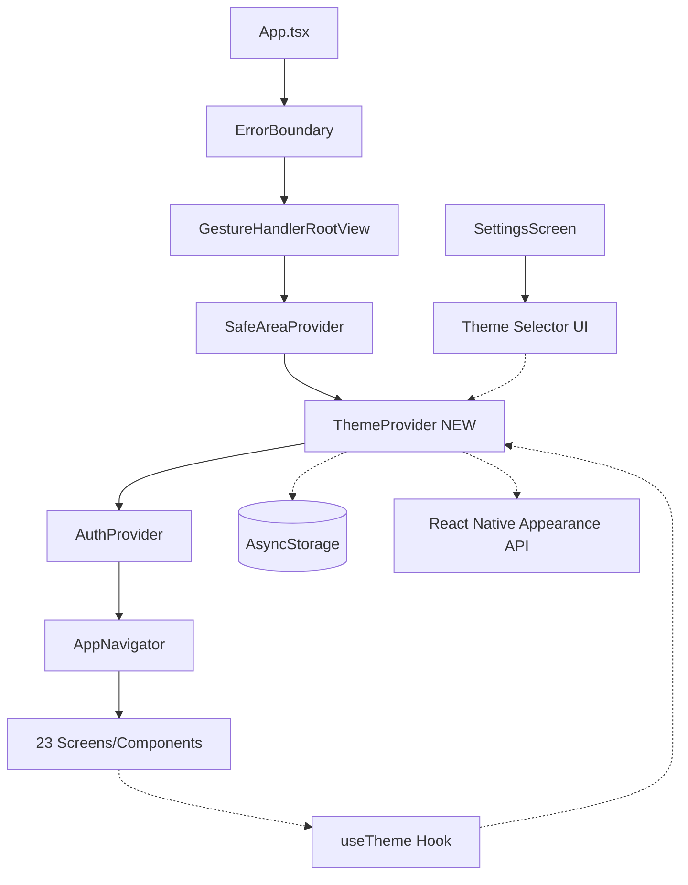
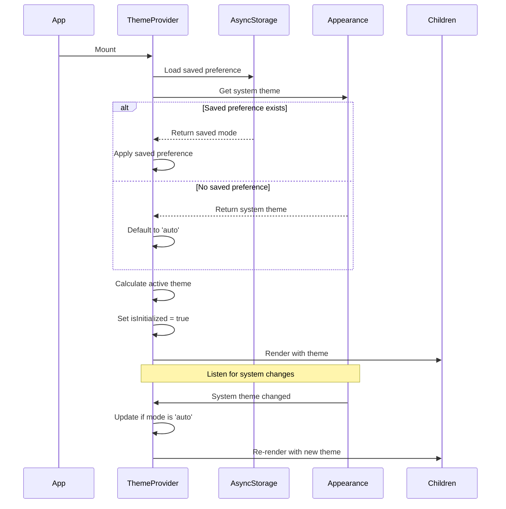
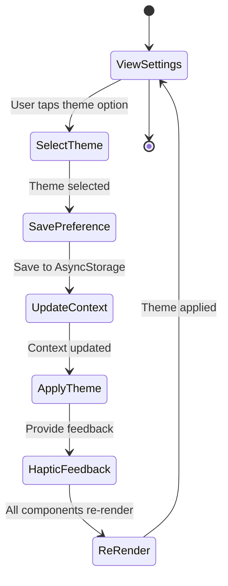
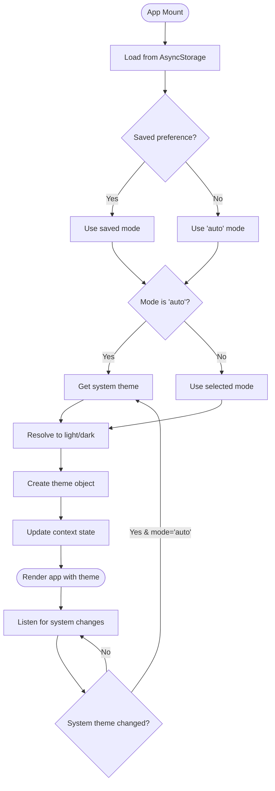
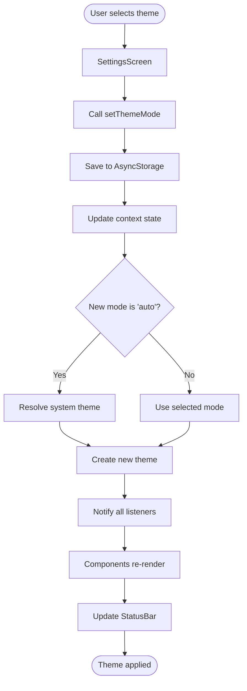
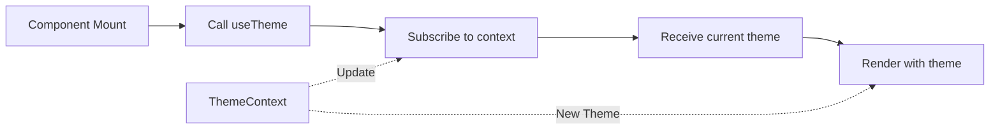

# Theme Switching Architecture Design

## Executive Summary

This document outlines the technical architecture for implementing theme switching (Light/Dark/Auto modes) in the React Native subscription tracking app. The design follows React best practices, leverages React Native's Appearance API, and ensures type safety throughout.

**Key Design Principles:**
- User preference takes priority over system theme
- Seamless transition between themes without app restart
- Type-safe implementation with TypeScript
- Minimal performance impact
- Backward compatible with existing codebase

---

## 1. System Architecture Overview



---

## 2. ThemeContext Architecture

### 2.1 TypeScript Interfaces

```typescript
// contexts/ThemeContext.tsx

export type ThemeMode = 'light' | 'dark' | 'auto';

export interface ThemeColors {
  primary: string;
  secondary: string;
  background: string;
  surface: string;
  text: string;
  textSecondary: string;
  border: string;
  error: string;
  success: string;
  warning: string;
  card: string;
  shadow: string;
}

export interface Theme {
  colors: ThemeColors;
  spacing: {
    xs: number;
    sm: number;
    md: number;
    lg: number;
    xl: number;
    xxl: number;
  };
  typography: {
    h1: { fontSize: number; fontWeight: string; lineHeight: number };
    h2: { fontSize: number; fontWeight: string; lineHeight: number };
    h3: { fontSize: number; fontWeight: string; lineHeight: number };
    body: { fontSize: number; fontWeight: string; lineHeight: number };
    bodyBold: { fontSize: number; fontWeight: string; lineHeight: number };
    caption: { fontSize: number; fontWeight: string; lineHeight: number };
    captionBold: { fontSize: number; fontWeight: string; lineHeight: number };
  };
  borderRadius: {
    sm: number;
    md: number;
    lg: number;
    xl: number;
    full: number;
  };
  shadows: {
    sm: any;
    md: any;
    lg: any;
  };
  isDark: boolean; // Helper for conditional styling
}

export interface ThemeContextType {
  theme: Theme;
  themeMode: ThemeMode;
  setThemeMode: (mode: ThemeMode) => Promise<void>;
  activeColorScheme: 'light' | 'dark'; // Resolved color scheme
}
```

### 2.2 State Management Structure

```typescript
interface ThemeState {
  themeMode: ThemeMode;           // User preference: 'light' | 'dark' | 'auto'
  systemColorScheme: ColorSchemeName;  // System preference from Appearance API
  currentTheme: Theme;             // Active theme object
  isInitialized: boolean;          // Prevents flash of wrong theme
}
```

### 2.3 AsyncStorage Key Convention

```typescript
// Storage key constants
const THEME_STORAGE_KEY = '@app_theme_preference';

// Storage value structure
type StoredThemePreference = 'light' | 'dark' | 'auto';
```

### 2.4 System Theme Detection

```typescript
// Using React Native's Appearance API
import { Appearance } from 'react-native';

// Initial detection
const systemColorScheme = Appearance.getColorScheme(); // Returns 'light' | 'dark' | null

// Real-time updates
const subscription = Appearance.addChangeListener(({ colorScheme }) => {
  // Handle system theme changes when mode is 'auto'
});
```

### 2.5 Theme Initialization Flow



---

## 3. Modified Theme System

### 3.1 Theme Factory Function

**File:** `constants/theme.ts`

```typescript
// Convert from static export to factory function
import { Platform } from 'react-native';
import { colors } from './colors';

export type ThemeColorMode = 'light' | 'dark';

export function createTheme(mode: ThemeColorMode) {
  const colorPalette = mode === 'light' ? colors.light : colors.dark;
  
  return {
    colors: colorPalette,
    spacing: {
      xs: 4,
      sm: 8,
      md: 16,
      lg: 24,
      xl: 32,
      xxl: 48,
    },
    typography: {
      h1: {
        fontSize: 32,
        fontWeight: '700' as const,
        lineHeight: 40,
      },
      h2: {
        fontSize: 24,
        fontWeight: '600' as const,
        lineHeight: 32,
      },
      h3: {
        fontSize: 20,
        fontWeight: '600' as const,
        lineHeight: 28,
      },
      body: {
        fontSize: 16,
        fontWeight: '400' as const,
        lineHeight: 24,
      },
      bodyBold: {
        fontSize: 16,
        fontWeight: '600' as const,
        lineHeight: 24,
      },
      caption: {
        fontSize: 14,
        fontWeight: '400' as const,
        lineHeight: 20,
      },
      captionBold: {
        fontSize: 14,
        fontWeight: '600' as const,
        lineHeight: 20,
      },
    },
    borderRadius: {
      sm: 8,
      md: 12,
      lg: 16,
      xl: 24,
      full: 9999,
    },
    shadows: {
      sm: Platform.select({
        ios: {
          shadowColor: colorPalette.shadow,
          shadowOffset: { width: 0, height: 1 },
          shadowOpacity: mode === 'light' ? 0.1 : 0.3,
          shadowRadius: 2,
        },
        android: {
          elevation: 2,
        },
      }),
      md: Platform.select({
        ios: {
          shadowColor: colorPalette.shadow,
          shadowOffset: { width: 0, height: 2 },
          shadowOpacity: mode === 'light' ? 0.15 : 0.35,
          shadowRadius: 4,
        },
        android: {
          elevation: 4,
        },
      }),
      lg: Platform.select({
        ios: {
          shadowColor: colorPalette.shadow,
          shadowOffset: { width: 0, height: 4 },
          shadowOpacity: mode === 'light' ? 0.2 : 0.4,
          shadowRadius: 8,
        },
        android: {
          elevation: 8,
        },
      }),
    },
    isDark: mode === 'dark',
  };
}

// Export default theme for backward compatibility during migration
export const theme = createTheme('dark');
```

### 3.2 Shadow Handling Strategy

**Problem:** Current shadows reference `colors.light.shadow` regardless of theme mode.

**Solution:** 
1. Use the active color palette's shadow color
2. Adjust shadow opacity based on theme mode (lighter shadows for dark mode)
3. Shadows in dark mode should be more prominent to maintain contrast

---

## 4. Settings Screen Integration

### 4.1 UI/UX Design

**Design Approach:** Three card-based options following existing Settings screen patterns

```
┌─────────────────────────────────────┐
│ Appearance                          │
├─────────────────────────────────────┤
│                                     │
│  ┌─────────────────────────────┐  │
│  │  ☀️  Light Mode              │  │
│  │  Bright and clear            │  │
│  │                          ✓   │  │
│  └─────────────────────────────┘  │
│                                     │
│  ┌─────────────────────────────┐  │
│  │  🌙  Dark Mode               │  │
│  │  Easy on the eyes            │  │
│  └─────────────────────────────┘  │
│                                     │
│  ┌─────────────────────────────┐  │
│  │  📱  Auto (System)           │  │
│  │  Follows device settings     │  │
│  └─────────────────────────────┘  │
│                                     │
└─────────────────────────────────────┘
```

### 4.2 Component Structure

**File:** `screens/SettingsScreen.tsx`

```typescript
// Add new section before "About" section

interface ThemeOption {
  mode: ThemeMode;
  icon: string;
  label: string;
  description: string;
}

const THEME_OPTIONS: ThemeOption[] = [
  {
    mode: 'light',
    icon: 'sunny',
    label: 'Light Mode',
    description: 'Bright and clear',
  },
  {
    mode: 'dark',
    icon: 'moon',
    label: 'Dark Mode',
    description: 'Easy on the eyes',
  },
  {
    mode: 'auto',
    icon: 'phone-portrait',
    label: 'Auto (System)',
    description: 'Follows device settings',
  },
];

// Component structure
<View style={styles.section}>
  <Text style={styles.sectionTitle}>Appearance</Text>
  <View style={styles.card}>
    {THEME_OPTIONS.map((option, index) => (
      <React.Fragment key={option.mode}>
        <TouchableOpacity
          style={styles.themeOption}
          onPress={() => handleThemeChange(option.mode)}
          activeOpacity={0.7}
        >
          <View style={styles.themeOptionLeft}>
            <View style={styles.themeIconContainer}>
              <Ionicons name={option.icon} size={24} color={theme.colors.primary} />
            </View>
            <View style={styles.themeOptionText}>
              <Text style={styles.themeLabel}>{option.label}</Text>
              <Text style={styles.themeDescription}>{option.description}</Text>
            </View>
          </View>
          {themeMode === option.mode && (
            <Ionicons name="checkmark-circle" size={24} color={theme.colors.primary} />
          )}
        </TouchableOpacity>
        {index < THEME_OPTIONS.length - 1 && <View style={styles.divider} />}
      </React.Fragment>
    ))}
  </View>
</View>
```

### 4.3 User Interaction Flow



### 4.4 Haptic Feedback Integration

```typescript
const handleThemeChange = async (mode: ThemeMode) => {
  if (Platform.OS === 'ios') {
    Haptics.notificationAsync(Haptics.NotificationFeedbackType.Success);
  }
  
  await setThemeMode(mode);
};
```

---

## 5. App Integration

### 5.1 Provider Hierarchy

**Current Structure:**
```
ErrorBoundary
└── GestureHandlerRootView
    └── SafeAreaProvider
        └── AuthProvider
            └── AppNavigator
```

**New Structure:**
```
ErrorBoundary
└── GestureHandlerRootView
    └── SafeAreaProvider
        └── ThemeProvider ← NEW (wraps AuthProvider)
            └── AuthProvider
                └── AppNavigator
```

**Rationale:**
- ThemeProvider above AuthProvider: Theme is fundamental to all UI rendering
- Below SafeAreaProvider: ThemeProvider may need safe area context
- Above AuthProvider: Auth screens need theme support

### 5.2 App.tsx Integration

```typescript
// File: App.tsx

import { ThemeProvider } from './contexts/ThemeContext';

export default function App() {
  return (
    <ErrorBoundary>
      <GestureHandlerRootView style={styles.container}>
        <SafeAreaProvider>
          <ThemeProvider>
            <AuthProvider>
              <StatusBar style="auto" /> {/* Will be managed by ThemeProvider */}
              <AppNavigator />
            </AuthProvider>
          </ThemeProvider>
        </SafeAreaProvider>
      </GestureHandlerRootView>
    </ErrorBoundary>
  );
}

// Remove theme from styles - will use dynamic theming
const styles = StyleSheet.create({
  container: {
    flex: 1,
    // backgroundColor removed - handled by theme
  },
});
```

### 5.3 StatusBar Handling

**Strategy:** StatusBar style should automatically match theme

```typescript
// In ThemeProvider component
import { StatusBar } from 'expo-status-bar';

<StatusBar 
  style={activeColorScheme === 'dark' ? 'light' : 'dark'} 
  backgroundColor={currentTheme.colors.background}
/>
```

**StatusBar Style Logic:**
- Dark theme → `style="light"` (white icons/text)
- Light theme → `style="dark"` (black icons/text)

### 5.4 Migration Strategy for Existing Imports

**Phase 1: Create Hook (No Breaking Changes)**
```typescript
// All existing imports continue to work
import { theme } from '../constants/theme';
```

**Phase 2: Gradual Migration**
```typescript
// New components use hook
import { useTheme } from '../contexts/ThemeContext';

function MyComponent() {
  const { theme } = useTheme();
  // Use theme as before
}
```

**Phase 3: Complete Migration**
- All 23 files updated to use `useTheme()`
- Static export removed from `constants/theme.ts`
- Only factory function remains

**Migration Pattern:**
```typescript
// BEFORE
import { theme } from '../constants/theme';

const styles = StyleSheet.create({
  container: {
    backgroundColor: theme.colors.background,
  },
});

// AFTER
import { useTheme } from '../contexts/ThemeContext';

function Component() {
  const { theme } = useTheme();
  
  const styles = StyleSheet.create({
    container: {
      backgroundColor: theme.colors.background,
    },
  });
  
  return <View style={styles.container} />;
}
```

### 5.5 Navigator Theme Updates

**File:** `navigation/AppNavigator.tsx`

```typescript
// Update all navigator screenOptions to use dynamic theme
function SubscriptionsNavigator() {
  const { theme } = useTheme();
  
  return (
    <SubscriptionsStack.Navigator
      screenOptions={{
        headerStyle: {
          backgroundColor: theme.colors.background,
          // ... other styles using theme
        },
        headerTintColor: theme.colors.text,
        cardStyle: {
          backgroundColor: theme.colors.background,
        },
      }}>
      {/* screens */}
    </SubscriptionsStack.Navigator>
  );
}

// Update Tab Navigator
function TabNavigator() {
  const { theme, activeColorScheme } = useTheme();
  
  return (
    <Tab.Navigator
      screenOptions={{
        tabBarActiveTintColor: theme.colors.text,
        tabBarInactiveTintColor: theme.colors.textSecondary,
        tabBarStyle: {
          backgroundColor: theme.colors.background,
          borderTopColor: theme.colors.border,
          // ... other styles
        },
      }}>
      {/* tabs */}
    </Tab.Navigator>
  );
}
```

---

## 6. File Structure

### 6.1 Files to Create

```
contexts/
└── ThemeContext.tsx          ← NEW: ThemeProvider, useTheme hook, interfaces
```

### 6.2 Files to Modify

**High Priority (Core Implementation):**
1. `constants/theme.ts` - Convert to factory function
2. `App.tsx` - Add ThemeProvider to hierarchy
3. `screens/SettingsScreen.tsx` - Add theme selector UI

**Medium Priority (Navigation):**
4. `navigation/AppNavigator.tsx` - Use dynamic theme in navigators

**Low Priority (Component Migration - 23 files):**
5. `components/AuthInput.tsx`
6. `components/CategoryBadge.tsx`
7. `components/CategoryBar.tsx`
8. `components/EmptyState.tsx`
9. `components/ErrorBoundary.tsx`
10. `components/InsightCard.tsx`
11. `components/LoadingIndicator.tsx`
12. `components/RenewalItem.tsx`
13. `components/StatCard.tsx`
14. `components/SubscriptionCard.tsx`
15. `components/SubscriptionForm.tsx`
16. `components/SummaryCard.tsx`
17. `screens/AddSubscriptionScreen.tsx`
18. `screens/EditSubscriptionScreen.tsx`
19. `screens/ForgotPasswordScreen.tsx`
20. `screens/HomeScreen.tsx`
21. `screens/LoginScreen.tsx`
22. `screens/OnboardingScreen.tsx`
23. `screens/SignUpScreen.tsx`
24. `screens/StatsScreen.tsx`

### 6.3 Import/Export Patterns

**ThemeContext Exports:**
```typescript
// contexts/ThemeContext.tsx
export type ThemeMode = 'light' | 'dark' | 'auto';
export type { Theme, ThemeColors, ThemeContextType };
export { ThemeProvider };
export { useTheme };
```

**Updated Theme Constants:**
```typescript
// constants/theme.ts
export type ThemeColorMode = 'light' | 'dark';
export { createTheme };
export { theme }; // Temporary - for backward compatibility
```

**Usage Pattern:**
```typescript
// In components
import { useTheme } from '../contexts/ThemeContext';

function MyComponent() {
  const { theme, themeMode, setThemeMode } = useTheme();
  // Use theme
}
```

---

## 7. State Flow Diagrams

### 7.1 Theme Initialization



### 7.2 User Theme Change Flow



### 7.3 Component Consumption Pattern



---

## 8. Edge Cases & Considerations

### 8.1 Performance Optimization

**Problem:** All components re-render on theme change

**Solutions:**
1. Use `React.memo()` for expensive components
2. Split theme object into smaller contexts if needed
3. Memoize theme object creation with `useMemo()`

```typescript
const theme = useMemo(
  () => createTheme(activeColorScheme),
  [activeColorScheme]
);
```

### 8.2 Flash of Wrong Theme (FOWT)

**Problem:** App shows wrong theme briefly during initialization

**Solution:** 
1. Set `isInitialized` state in ThemeProvider
2. Show splash/loading screen until theme is loaded
3. Load theme preference before rendering app content

```typescript
if (!isInitialized) {
  return (
    <View style={{ flex: 1, backgroundColor: '#000' }}>
      <ActivityIndicator />
    </View>
  );
}
```

### 8.3 System Theme Change During Runtime

**Scenario:** User changes device theme while app is open, mode is 'auto'

**Handling:**
```typescript
useEffect(() => {
  const subscription = Appearance.addChangeListener(({ colorScheme }) => {
    if (themeMode === 'auto') {
      // Update theme to match new system preference
      updateActiveTheme(colorScheme || 'dark');
    }
  });
  
  return () => subscription.remove();
}, [themeMode]);
```

### 8.4 Animated Theme Transition

**Current Decision:** Instant theme change (best practice)

**Future Enhancement Option:**
```typescript
// Could add animated transition using react-native-reanimated
import { Animated } from 'react-native';

// Fade out -> change theme -> fade in
// Implementation deferred to future iteration
```

### 8.5 AsyncStorage Failure Handling

**Scenario:** AsyncStorage.setItem fails

**Handling:**
```typescript
const setThemeMode = async (mode: ThemeMode) => {
  try {
    await AsyncStorage.setItem(THEME_STORAGE_KEY, mode);
    updateThemeState(mode);
  } catch (error) {
    console.error('Failed to save theme preference:', error);
    // Still update UI theme, just don't persist
    updateThemeState(mode);
    // Optionally show error toast
  }
};
```

### 8.6 TypeScript Type Safety

**Consideration:** Ensure all theme properties are type-safe

**Strategy:**
1. Strong typing for ThemeMode
2. Readonly theme object to prevent mutations
3. Type guards for color scheme resolution

```typescript
type ThemeMode = 'light' | 'dark' | 'auto'; // Union type, not string
type ColorScheme = 'light' | 'dark'; // Resolved scheme

function isColorScheme(value: any): value is ColorScheme {
  return value === 'light' || value === 'dark';
}
```

### 8.7 Modal and Overlay Handling

**Consideration:** React Native Modals render outside normal hierarchy

**Solution:** Modals inherit theme from parent component before mounting
```typescript
// Modal components should use useTheme() hook
function MyModal() {
  const { theme } = useTheme(); // Works because provider is at root
  // Theme will be correct
}
```

---

## 9. Implementation Checklist

### Phase 1: Core Infrastructure
- [ ] Create `contexts/ThemeContext.tsx` with all interfaces
- [ ] Implement ThemeProvider component with initialization logic
- [ ] Implement useTheme hook
- [ ] Add system theme detection with Appearance API
- [ ] Add AsyncStorage persistence
- [ ] Handle edge cases (FOWT, errors, system changes)

### Phase 2: Theme System
- [ ] Convert `constants/theme.ts` to factory function
- [ ] Update shadow definitions to use active color palette
- [ ] Add `isDark` helper property
- [ ] Maintain backward compatibility with default export

### Phase 3: App Integration
- [ ] Add ThemeProvider to `App.tsx` provider hierarchy
- [ ] Update StatusBar handling in ThemeProvider
- [ ] Remove hardcoded theme from App.tsx styles

### Phase 4: Settings UI
- [ ] Add Appearance section to SettingsScreen
- [ ] Create three theme option cards
- [ ] Implement theme selection handler
- [ ] Add haptic feedback
- [ ] Show selected theme with checkmark

### Phase 5: Navigation Updates
- [ ] Update AppNavigator.tsx to use useTheme
- [ ] Update all Stack navigators (Subscriptions, Stats, Settings)
- [ ] Update Tab navigator styling
- [ ] Test navigation theme consistency

### Phase 6: Component Migration (23 files)
- [ ] Migrate all screens (11 files)
- [ ] Migrate all components (12 files)
- [ ] Replace `import { theme }` with `useTheme()` hook
- [ ] Move StyleSheet.create() inside component functions
- [ ] Test each component after migration

### Phase 7: Testing & Polish
- [ ] Test theme switching on iOS
- [ ] Test theme switching on Android
- [ ] Test 'auto' mode with system theme changes
- [ ] Test app restart with saved preference
- [ ] Test AsyncStorage failure scenarios
- [ ] Verify no FOWT occurs
- [ ] Performance testing with React DevTools
- [ ] Accessibility testing (contrast ratios)

---

## 10. Testing Strategy

### 10.1 Unit Tests
```typescript
// contexts/__tests__/ThemeContext.test.tsx
describe('ThemeContext', () => {
  it('should initialize with dark theme by default', () => {});
  it('should load saved preference from AsyncStorage', () => {});
  it('should respect system theme when mode is auto', () => {});
  it('should persist theme changes to AsyncStorage', () => {});
  it('should handle AsyncStorage errors gracefully', () => {});
});
```

### 10.2 Integration Tests
```typescript
// __tests__/ThemeSwitching.test.tsx
describe('Theme Switching', () => {
  it('should update all components when theme changes', () => {});
  it('should update StatusBar when theme changes', () => {});
  it('should update navigation colors when theme changes', () => {});
});
```

### 10.3 Manual Testing Checklist
- [ ] Switch to Light mode → verify all screens
- [ ] Switch to Dark mode → verify all screens
- [ ] Switch to Auto mode → verify follows system
- [ ] Change system theme while app open (Auto mode)
- [ ] Restart app → verify persisted preference
- [ ] Test on iOS device
- [ ] Test on Android device
- [ ] Test with slow network (AsyncStorage delays)

---

## 11. Migration Timeline

**Estimated Effort:** 2-3 development days

### Day 1: Core Implementation
- Morning: ThemeContext + ThemeProvider (3-4 hours)
- Afternoon: Theme factory function + App integration (2-3 hours)

### Day 2: UI & Navigation
- Morning: Settings screen theme selector (2-3 hours)
- Afternoon: Navigation updates + initial testing (3-4 hours)

### Day 3: Component Migration & Testing
- Morning: Migrate 11 screens (3-4 hours)
- Afternoon: Migrate 12 components + comprehensive testing (3-4 hours)

---

## 12. Success Metrics

**Functional:**
- ✅ User can switch between Light, Dark, and Auto modes
- ✅ Theme preference persists across app restarts
- ✅ Auto mode follows system theme changes in real-time
- ✅ All 23 screens/components render correctly in both themes

**Technical:**
- ✅ No flash of wrong theme on app startup
- ✅ Theme change is instant (< 100ms perceived)
- ✅ No memory leaks from Appearance listeners
- ✅ Type-safe throughout (no `any` types)

**User Experience:**
- ✅ Smooth transition between themes
- ✅ Haptic feedback on theme selection
- ✅ Clear visual indication of selected theme
- ✅ Accessible contrast ratios in both modes

---

## 13. Future Enhancements

**Not in scope for initial implementation, but documented for future:**

1. **Custom Theme Colors:** Allow users to customize accent colors
2. **High Contrast Themes:** WCAG AAA compliant alternatives
3. **Scheduled Theme Switching:** Auto switch based on time of day
4. **Per-Screen Theme:** Different themes for different parts of app
5. **Theme Preview:** Show preview before applying
6. **Animated Transitions:** Smooth fade between themes

---

## 14. References

**React Native Documentation:**
- [Appearance API](https://reactnative.dev/docs/appearance)
- [Context API](https://react.dev/reference/react/useContext)
- [AsyncStorage](https://react-native-async-storage.github.io/async-storage/)

**Best Practices:**
- [React Native Theme Switching](https://www.reactnative.dev/blog/2021/03/11/version-0.64#appearance-changes)
- [iOS HIG - Dark Mode](https://developer.apple.com/design/human-interface-guidelines/dark-mode)
- [Material Design - Dark Theme](https://material.io/design/color/dark-theme.html)

---

## Appendix A: Complete Code Examples

### A.1 ThemeContext Full Implementation

```typescript
// contexts/ThemeContext.tsx (Complete implementation example)
import React, { createContext, useContext, useState, useEffect, ReactNode, useMemo } from 'react';
import { Appearance, ColorSchemeName } from 'react-native';
import AsyncStorage from '@react-native-async-storage/async-storage';
import { createTheme, ThemeColorMode } from '../constants/theme';
import { StatusBar } from 'expo-status-bar';

export type ThemeMode = 'light' | 'dark' | 'auto';

export interface ThemeContextType {
  theme: ReturnType<typeof createTheme>;
  themeMode: ThemeMode;
  setThemeMode: (mode: ThemeMode) => Promise<void>;
  activeColorScheme: 'light' | 'dark';
}

const ThemeContext = createContext<ThemeContextType | undefined>(undefined);

const THEME_STORAGE_KEY = '@app_theme_preference';

interface ThemeProviderProps {
  children: ReactNode;
}

export function ThemeProvider({ children }: ThemeProviderProps) {
  const [themeMode, setThemeModeState] = useState<ThemeMode>('auto');
  const [systemColorScheme, setSystemColorScheme] = useState<ColorSchemeName>(
    Appearance.getColorScheme()
  );
  const [isInitialized, setIsInitialized] = useState(false);

  // Calculate active color scheme
  const activeColorScheme: 'light' | 'dark' = useMemo(() => {
    if (themeMode === 'auto') {
      return systemColorScheme === 'light' ? 'light' : 'dark';
    }
    return themeMode;
  }, [themeMode, systemColorScheme]);

  // Create theme object
  const theme = useMemo(
    () => createTheme(activeColorScheme),
    [activeColorScheme]
  );

  // Initialize theme on mount
  useEffect(() => {
    initializeTheme();
  }, []);

  // Listen for system theme changes
  useEffect(() => {
    const subscription = Appearance.addChangeListener(({ colorScheme }) => {
      setSystemColorScheme(colorScheme);
    });

    return () => subscription.remove();
  }, []);

  const initializeTheme = async () => {
    try {
      const savedMode = await AsyncStorage.getItem(THEME_STORAGE_KEY);
      if (savedMode && isValidThemeMode(savedMode)) {
        setThemeModeState(savedMode as ThemeMode);
      }
    } catch (error) {
      console.error('Failed to load theme preference:', error);
    } finally {
      setIsInitialized(true);
    }
  };

  const setThemeMode = async (mode: ThemeMode): Promise<void> => {
    try {
      await AsyncStorage.setItem(THEME_STORAGE_KEY, mode);
      setThemeModeState(mode);
    } catch (error) {
      console.error('Failed to save theme preference:', error);
      setThemeModeState(mode); // Still update UI
    }
  };

  const value: ThemeContextType = {
    theme,
    themeMode,
    setThemeMode,
    activeColorScheme,
  };

  // Show loading state until theme is initialized
  if (!isInitialized) {
    return (
      <View style={{ flex: 1, backgroundColor: '#000000' }}>
        <ActivityIndicator size="large" color="#0A84FF" />
      </View>
    );
  }

  return (
    <ThemeContext.Provider value={value}>
      <StatusBar 
        style={activeColorScheme === 'dark' ? 'light' : 'dark'}
        backgroundColor={theme.colors.background}
      />
      {children}
    </ThemeContext.Provider>
  );
}

export function useTheme(): ThemeContextType {
  const context = useContext(ThemeContext);
  if (context === undefined) {
    throw new Error('useTheme must be used within a ThemeProvider');
  }
  return context;
}

function isValidThemeMode(value: string): value is ThemeMode {
  return value === 'light' || value === 'dark' || value === 'auto';
}
```

### A.2 Settings Screen Theme Selector Styles

```typescript
// Additional styles for SettingsScreen.tsx
const themeStyles = StyleSheet.create({
  themeOption: {
    flexDirection: 'row',
    alignItems: 'center',
    justifyContent: 'space-between',
    paddingVertical: theme.spacing.md,
  },
  themeOptionLeft: {
    flexDirection: 'row',
    alignItems: 'center',
    flex: 1,
  },
  themeIconContainer: {
    width: 48,
    height: 48,
    borderRadius: 24,
    backgroundColor: `${theme.colors.primary}20`,
    justifyContent: 'center',
    alignItems: 'center',
    marginRight: theme.spacing.md,
  },
  themeOptionText: {
    flex: 1,
  },
  themeLabel: {
    fontSize: 16,
    fontWeight: '600',
    color: theme.colors.text,
    marginBottom: 2,
  },
  themeDescription: {
    fontSize: 14,
    color: theme.colors.textSecondary,
  },
});
```

---

## Document Metadata

- **Author:** Technical Architecture Team
- **Version:** 1.0.0
- **Last Updated:** 2025-11-11
- **Status:** Ready for Implementation
- **Estimated Complexity:** Medium
- **Dependencies:** React, React Native, Expo, AsyncStorage